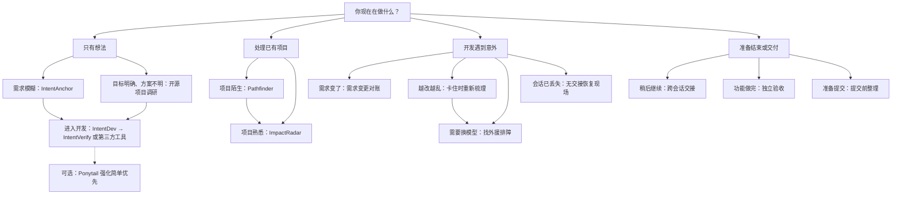

# Blue SkillHub

Blue SkillHub 是一套面向 AI 编码助手的工作流工具。无论是把一个模糊想法说清楚、快速看懂陌生项目，还是修改已有系统，都有对应的工具可以使用。

开源模型已经能完成不少编码任务，但在长任务和高风险变更中仍不够稳定：它可能理解错需求、漏掉调用方、跳过验证，或者把尚未完成的工作说成已经完成。这个仓库不试图让模型变得更聪明，而是把容易丢失的意图、项目事实和执行状态写进文件，再让脚本检查其中能够自动验证的部分。

## 先看这里：你现在遇到了什么情况？

不用先研究所有 Skill 和 Prompt。找到最接近你当前处境的一行，从推荐的入口开始即可。



状态图用来快速找到入口；具体什么时候使用、用完以后去哪里，继续看下面的表格。

| 你现在的处境 | 现在先做什么 | 用完以后 |
|---|---|---|
| 只有一个模糊想法，还说不清给谁用、解决什么问题 | 用 [IntentAnchor](skills/intent-anchor/) 把目标、取舍和不可妥协项写进 `INTENT.md` | 目标明确后，用 [IntentPRD](skills/intent-prd/) 生成 PRD，再用 [IntentIssues](skills/intent-issues/) 拆工单，然后用 [IntentDev](skills/intent-dev/) 开发和 [IntentVerify](skills/intent-verify/) 验收；没有 `INTENT.md` 时用原版 to-prd / to-issues |
| 已经知道要做什么，但不确定架构和技术路线 | 用 [开工前调研开源项目](prompt/open-source-project-research.md) 比较真正相似的项目 | 看过证据并确认方案后再开始开发 |
| 方向和方案已经明确，准备从零实现完整产品 | 完整流程选 [Superpowers](https://github.com/obra/superpowers)，按需组合选 [Skills for Real Engineers](https://github.com/mattpocock/skills) | 如果模型仍然常把简单需求做复杂，可以再用 [Ponytail](https://github.com/DietrichGebert/ponytail) 强化“简单优先” |
| 刚接手一个陌生仓库，不知道入口和模块关系 | 用 [Pathfinder](skills/pathfinder/) 只读摸清项目 | 有具体改动时进入 ImpactRadar |
| 已经熟悉项目，准备新增功能、修 Bug 或重构 | 用 [ImpactRadar](skills/impact/) 分析影响并逐步实施 | 完成后做独立验收和提交前整理 |
| 开发中途需求变了，新旧说法可能混在一起 | 用 [需求变更对账](prompt/requirement-change-reconciliation.md) 找出当前仍然有效的要求 | 目标变了就回到 IntentAnchor；只是改动范围变化就回到 ImpactRadar |
| 同一个问题反复修改，尝试越来越乱 | 用 [卡住时重新梳理](prompt/stuck-reassessment.md) 区分事实、猜测和已排除项 | 有新方向就继续验证；仍无方向再找外援 |
| 当前模型已经绕了多轮，准备换更强的模型接手 | 用 [找外援排障](prompt/expert-escalation.md) 整理复现方法、失败尝试和现场 | 把生成的完整指令交给新模型 |
| 会话快结束了，任务还要跨天或换会话继续 | 用 [跨会话交接](prompt/session-handoff.md) 生成 `HANDOFF.md` | 新会话先读取并核对交接文档 |
| 原会话已经丢失，也没有可靠的交接记录 | 用 [无交接恢复现场](prompt/workspace-recovery.md) 从 Git 和项目文件还原进度 | 用户确认恢复结果后再继续修改 |
| 实现会话说任务已经完成，想换个模型从头检查 | 用 [生成独立验收指令](prompt/independent-review-request.md) 准备完整验收材料 | 交给能访问同一工作区的新会话执行验收 |
| 准备提交，但正式改动、调试残留和原有文件混在一起 | 用 [提交前整理改动](prompt/pre-commit-cleanup.md) 先划清提交范围 | 用户确认后再清理、暂存和提交 |
| 任务依赖截图、设计稿、架构图或报错图片 | 用 [VL 识图](skills/vl-vision/) 提取图片中的信息 | 把结果交给当前主流程，并回到源码或原图核实关键结论 |
| 需要查询 GitHub、官方文档或外部资料，而当前客户端不能联网 | 接入 [网搜 MCP](mcp/web-search-mcp/) | 打开原始页面核实关键结论，不要只看搜索摘要 |

[律刃](claudecode行为规范/ruleblade/) 不属于某一个场景。它是一组可以在整个编码过程中常驻的行为规则，要求 AI 先弄清目标和上下文，再进行修改。

## 常用完整路线

下面是最常见的搭配，不要求每次把所有工具都走一遍。

- **从模糊想法开始做新项目**：律刃 → IntentAnchor → 需要时调研开源项目 → 用 IntentPRD 生成 PRD → 用 IntentIssues 拆工单 → 用 IntentDev 开发 → 用 IntentVerify 端到端验收 → 提交前整理。也可以选择 Superpowers 或 Skills for Real Engineers 进入开发。担心 AI 把简单需求做复杂时，可以在开发阶段搭配 Ponytail。
- **接手陌生项目并准备修改**：律刃 → Pathfinder → 需求仍然模糊时使用 IntentAnchor → ImpactRadar → 独立验收 → 提交前整理。
- **熟悉项目中的明确改动**：律刃 → ImpactRadar → 验证 → 独立验收或提交前整理。不必为了流程完整强行运行 Pathfinder。
- **开发中途需求改变**：先暂停修改 → 需求变更对账 → 目标变化时回到 IntentAnchor，改动范围变化时回到 ImpactRadar。
- **问题久攻不下**：卡住时重新梳理 → 有新线索就做一次针对性验证 → 仍无新方向时生成找外援材料并换模型。
- **跨会话继续工作**：旧会话生成 `HANDOFF.md` → 新会话读取并核对现场；没有交接文档时，改用无交接恢复现场。
- **实现完成准备交付**：如果 diff 已经说不清，先整理改动；如果改动范围清楚，先独立验收。验收发现问题就返回实现环节，最终提交前再检查一次工作区。

## 从零开始开发

IntentAnchor 负责先把方向说清楚，"开工前调研开源项目"负责在技术路线不确定时查找依据。方向和方案确认以后，有两条路可以选：用 Blue SkillHub 自己的完整链路（IntentPRD → IntentIssues → IntentDev → IntentVerify）继续往下走，或者使用下面的第三方工具。

完整链路：

```text
intent-anchor → intent.md（意图、能力、验收路径、设计标准、术语表、性能/安全要求）
    ↓ 强制输入
intent-prd → prd.md（原生引用能力表和验收路径，Acceptance Criteria 用 Given/When/Then 结构）
    ↓ 强制输入
intent-issues → issues.md（自动引用路径编号，自动检查覆盖）
    ↓ 强制输入
intent-dev → dev-record.md（TDD 循环，每条 Then 按实际运行结果判定验证等级）
    ↓ 强制输入
intent-verify → verify-record.md（全量回归 + 端到端验收路径 + 条件性验证 + 漂移复核）
```

### IntentPRD 和 IntentIssues：让 INTENT.md 的约束一路传到工单

[IntentPRD](skills/intent-prd/) 和 [IntentIssues](skills/intent-issues/) 是 Blue SkillHub 自己开发的两个 Skill，分别负责从 `INTENT.md` 生成 PRD 和拆分工单。

之所以自己做而不直接用第三方 [to-prd](https://github.com/mattpocock/skills) 和 [to-issues](https://github.com/mattpocock/skills)，是因为第三方 Skill 不认识 `INTENT.md` 的结构。IntentAnchor 产出的设计标准、术语表、验收路径、性能要求和安全要求，如果交给第三方 Skill，只能靠交接 prompt 注入约束——下游 Skill 不会主动检查这些约束是否被遵守，传递不可靠。

IntentPRD 和 IntentIssues 原生解析 `INTENT.md` 的各章节，把设计标准映射到 PRD 的 Implementation Decisions，把验收路径映射到 PRD 的 Acceptance Criteria，把术语表传递到工单的界面文案约束。IntentIssues 还会自动检查所有验收路径是否被至少一个工单覆盖。

两个 Skill 都强制要求 `INTENT.md` 作为输入；没有 `INTENT.md` 时，直接用原版 to-prd / to-issues 即可。

### IntentDev 和 IntentVerify：从开发到端到端验收

[IntentDev](skills/intent-dev/) 和 [IntentVerify](skills/intent-verify/) 是 Blue SkillHub 自己开发的两个 Skill，分别负责工单开发和端到端验收。

IntentDev 按 TDD 循环开发每个工单：先写测试看到红灯，再写代码看到绿灯，最后重构。修 bug 必须先写复现测试。每条验收条件根据实际运行的命令输出判定验证等级（V0 未验证 / V1 代码审查 / V2 实际运行通过），标 V2 但没有真实命令输出视为冒充，不允许标 done。

IntentVerify 在所有工单开发完成后做整体验收：先跑全量测试确认老功能没被改坏，再按 INTENT.md 第 14 节的验收路径逐条端到端走通，然后做条件性验证（性能和安全要求，有则逐项验证，没有标不适用），最后做最终复核（保留能力核对 + 漂移复核）。

两个 Skill 都强制要求前置产物作为输入：IntentDev 要求工单文件通过 `issues_validate.py` 校验，IntentVerify 要求 dev-record 通过 `dev_validate.py` 校验且所有工单标 done。

### Superpowers：希望一套流程带着项目往前走

[Superpowers](https://github.com/obra/superpowers) 覆盖需求澄清、设计确认、实施计划、TDD、多个 agent 分工开发和复核，适合不想自己编排每一个开发环节的人。

可以先把 `INTENT.md` 和开源调研结果交给它，再由它负责设计、计划和实现。已经用 IntentAnchor 把需求问清楚时，不必再同时运行两套内容相近的需求访谈。

### Skills for Real Engineers：只拿当前需要的工具

[Skills for Real Engineers](https://github.com/mattpocock/skills) 提供 `grill-with-docs`、`to-spec`、`to-tickets`、`implement`、`tdd`、`code-review` 等可以单独选择和组合的 Skill，适合希望自己掌控开发节奏的人。

已经用 IntentAnchor 明确需求时，可以从规格整理、任务拆分或实现环节接上。`grill-with-docs` 和 IntentAnchor 都会深入追问需求，通常选择一个作为主要入口即可。

### Ponytail：把“简单优先”变成一套检查顺序

[Ponytail](https://github.com/DietrichGebert/ponytail) 会在写代码前依次检查：这个功能是否真的需要、项目里是否已经有实现、标准库或平台是否已经提供。只有前面的办法都不合适时，才编写满足需求所需的代码。

这个方向与律刃的“简单优先”一致，但三者解决问题的位置不同：

- **律刃**规定通用编码行为：不增加需求之外的功能、抽象和配置，只改必须改的内容。
- **ImpactRadar**用于已有系统变更：该改的调用方、接口、数据和测试不能漏，不相关的地方不要顺手改。
- **Ponytail**把实现前的取舍变成固定顺序：先复用现有代码、标准库和平台能力，最后才新增最少的代码。

因此，Ponytail 不是用来补上 Blue SkillHub 完全缺失的能力，而是对“简单优先”的一种外部强化。模型已经能稳定遵守律刃时，没有必要为了工具齐全再叠加；模型仍然习惯重新造轮子或过度设计时，再考虑搭配使用。它不能代替需求确认、设计、测试、安全和验收。

这三个项目都由各自作者独立维护，不属于 Blue SkillHub。具体支持哪些 AI 客户端、怎样安装以及当前版本能力，请以上游仓库的最新说明为准。

## 三个核心 Skill 怎么分工

三项核心 Skill 可以独立使用，也可以按上面的路线配合。

| Skill | 什么时候用 | 主要作用 |
|---|---|---|
| **IntentAnchor** | 只有一个模糊想法，还没形成 PRD；也适用于系统转换和已有系统新增能力 | 把要做什么、不做什么和不可妥协项整理成 `INTENT.md` |
| **Pathfinder** | 刚接手一个不熟悉的现有项目 | 只读梳理技术栈、模块、入口、数据和风险区域，产出项目地图 |
| **ImpactRadar** | 准备修改已有系统，特别是模型容易漏步骤或任务本身风险较高时 | 分析改动会影响哪些代码、接口、数据和测试，并用严格门禁监督实施 |

这套工具不负责一键搭建完整系统。对于 0→1 项目，IntentAnchor 先帮你把方向说清楚，后续实现可以参考上面的第三方工具；面对已有代码时，可以用 Pathfinder 摸清项目，再由 ImpactRadar 分析并执行改动。

ImpactRadar 会根据任务风险选择流程。简单改动使用 `light` 模式，只保留必要检查；复杂或高风险改动使用 `full` 模式，补齐需求、设计、实施和验证文档。

你不必先写一份复杂的 Prompt。模糊想法可以通过 IntentAnchor 的三重锚定逐步说清楚；分析已有项目时，则以代码、配置和命令结果为准。ImpactRadar 到了实际写入阶段，仍需用 `确认 Step N` 明确授权。

Pathfinder 和 ImpactRadar 完成一次任务后，会在回复中附上一段简短记录，包括所用模型、运行模式、验证结果、是否被检查拦下过，以及最后的结果。这段记录默认只留在对话中，不会自动写入仓库。

如果三项核心 Skill 在运行中发现了一个可能值得改进自身的问题，会在收尾时用一句话询问是否记录。你只需要回复“记录”或“不用”；内部编号、复现和回归由维护流程处理，不要求普通用户了解。

## 3 分钟上手

按你的场景选择最短路径。

1. 安装需要的 Skill。

```powershell
Copy-Item "E:\agent\blue-skillhub\skills\pathfinder" "$env:USERPROFILE\.claude\skills\pathfinder" -Recurse -Force
Copy-Item "E:\agent\blue-skillhub\skills\impact" "$env:USERPROFILE\.claude\skills\impact" -Recurse -Force
Copy-Item "E:\agent\blue-skillhub\skills\intent-anchor" "$env:USERPROFILE\.claude\skills\intent-anchor" -Recurse -Force
Copy-Item "E:\agent\blue-skillhub\skills\intent-prd" "$env:USERPROFILE\.claude\skills\intent-prd" -Recurse -Force
Copy-Item "E:\agent\blue-skillhub\skills\intent-issues" "$env:USERPROFILE\.claude\skills\intent-issues" -Recurse -Force
Copy-Item "E:\agent\blue-skillhub\skills\intent-dev" "$env:USERPROFILE\.claude\skills\intent-dev" -Recurse -Force
Copy-Item "E:\agent\blue-skillhub\skills\intent-verify" "$env:USERPROFILE\.claude\skills\intent-verify" -Recurse -Force
```

Codex 用户把 `.claude\skills` 换成 `.codex\skills` 即可。其他安装方式见 [安装与验证清单](docs/install-and-verify-checklist.md)。

2. 根据任务选择入口。

如果还在构思 0→1 新产品，或者需求比较模糊：

```text
/intent-anchor
我想做一个帮助开发者整理跨会话工作进度的工具，但还没想清楚具体功能。
```

如果已经进入现有项目，需要先摸底或分析变更：

```text
/pathfinder
这个项目我刚接手，先帮我只读摸底。

/impact
我想删除 sys_user.remark 字段，先做影响分析，不要直接改代码。
```

`/intent-anchor` 不生成代码，只负责在头脑风暴或 PRD 之前产出 `INTENT.md`。`/impact` 支持 Java、Node.js、Python、Go 和前端项目等多种技术栈。如果已经熟悉项目结构，可以跳过 `/pathfinder`，直接使用 `/impact`。

3. 使用 ImpactRadar 改代码时，按步骤确认。

```text
确认 Step 2
```

只有明确回复 `确认 Step N` 才算授权。`继续`、`好的`、`全部确认` 都不算。Claude Code 用户可以启用 `.claude/hooks/impact-write-gate.*`，在工具执行前再次检查授权。

## 里面有什么

### Prompt 工具箱

[prompt/](prompt/)

这里放的是遇到具体麻烦时可以直接发给 AI 的指令，覆盖开工前调研、开发卡住、需求变化、会话切换、独立验收和提交前整理。首页上方的场景表可以帮你找到入口；各 Prompt 的选择边界和复制方法见 [Prompt 工具箱说明](prompt/README.md)。

### 律刃

[claudecode行为规范/ruleblade/](claudecode行为规范/ruleblade/)

律刃是一组写给 AI 编码助手的通用行为规则，共 8 条编码规则和 1 条中文表达要求。它要求模型先弄清目标和上下文，再动手修改；遇到不确定的地方要明确说明，不能靠猜。

这套规则既适用于新项目，也适用于已有项目。可以放进 `CLAUDE.md`，也可以按需复制成 Codex 项目的 `AGENTS.md`。它不绑定具体开发流程，修复 Bug、重构、补测试和普通开发都能使用。

律刃最初参考了 multica-ai/andrej-karpathy-skills 的 [CLAUDE.md](https://github.com/multica-ai/andrej-karpathy-skills/blob/main/CLAUDE.md)，后来结合中文编码任务和复杂变更持续调整。

v3.2 通过了 Claude Code + MiniMax M3 的两轮稳定性复测；v3.3 新增的五条规则也通过了 Step 3.7 Flash 的 6 个场景测试。详细记录见 [律刃 README](claudecode行为规范/ruleblade/README.md)。

### 网搜 MCP

[mcp/web-search-mcp/](mcp/web-search-mcp/)

为支持 MCP 的 AI 客户端提供网页搜索。它支持 Google、Bing、Brave 和 DuckDuckGo，既可以只返回搜索摘要，也可以继续打开网页提取正文。Cursor、CodeBuddy 和 Claude Desktop 等客户端都能接入。

### Pathfinder 领航

[skills/pathfinder/](skills/pathfinder/)

**先把项目看懂，再决定怎么改。** Pathfinder 适合刚接手、还不熟悉的现有项目。它不会修改代码，而是通读项目后生成一份项目地图，内容包括技术栈、核心功能、架构分层、关键入口、主要数据模型、运行方式、权限流程和风险区域。

Pathfinder 最重要的约束是不能把猜测写成事实。每条结论都要标成 `【已核实: 证据】` 或 `【推断: 待验证】`；如果当前目录不是独立 Git 仓库，它不会误用父目录仓库的提交信息；没有深入查看的部分也会明确列出。

项目地图保存在 `change-impact/_project-map.md`。ImpactRadar 启动时会先读取这份地图，用它定位可能相关的文件；其中标为推断的内容仍需回到源码核实。没有地图时，ImpactRadar 也能照常工作，因此 Pathfinder 不是强制的前置步骤。

项目变化后，可以继续深入某个模块、对照当前代码更新地图，或者重新生成整份地图。更新时会比较地图记录的 Git HEAD 与当前 HEAD，替换已经过期的内容。

如果客户端提供只读的 code graph 或 repo-map MCP，Pathfinder 会先用索引查找入口和依赖关系，再回到源码核实。索引不可用、结果不完整或需要在项目里写缓存时，就改用普通文件扫描。

Pathfinder 只会写自己管理的项目地图和 `facts` 文件，不会修改项目源码、配置或业务数据。设计复盘见 [Pathfinder 设计记录](docs/archive/2026-06/2026-06-13-pathfinder-skill-design.md)。

### ImpactRadar

[skills/impact/](skills/impact/)

ImpactRadar 用于修改已有系统。新增功能、调整字段或接口、修改权限与配置、重构旧代码，都可以先用它查清影响范围，再决定怎么实施。它支持 Java、Node.js、Python、Go 和前端项目等多种技术栈；Phase 2 会识别当前项目使用的技术栈，并从 `profiles/` 加载对应规则。

简单改动使用 `light` 模式，只生成一页摘要；复杂或高风险改动使用 `full` 模式，补齐需求、设计和实施文档。分析过程中，能从代码确认的事实由 AI 自行查证，涉及产品取舍、兼容策略或数据风险的决定则交给用户。

进入实施阶段后，每一步写操作都需要当前会话中的 `确认 Step N`。删除公开接口、修改数据库结构、调整权限等高风险操作必须单独确认，不能和其他步骤一起授权。Claude Code 用户建议启用 `.claude/hooks/impact-write-gate.*`，在工具真正执行前再检查一次授权。

`impact_validate.py` 提供 V1–V22 共 22 项自动检查，用来发现文档缺失、执行记录不完整、状态不一致和改动遗漏等问题。在 D19 真实交付测试中，MiniMax M3 三次提前声称已经完成，三次都被不同的检查拦下，修正后才通过验收。

#### 谁更需要这套严格门禁

ImpactRadar 会生成分析文档、要求逐步确认并运行自动检查。这些限制能减少漏改和提前宣布完成，但也会增加时间和交互成本，因此不适合不加判断地用于每一次修改。

- **能力较弱、速度优先或成本较低的模型**：更建议默认使用。模型越容易跳过上下文、漏查调用方或把未验证工作说成完成，门禁带来的帮助越明显。
- **Claude Opus 或同等级 GPT 模型**：处理边界清楚、风险较低的普通改动时，不建议默认使用完整的 ImpactRadar 流程。通常遵守律刃并直接完成针对性验证即可；仍想保留影响检查时，可以使用 `light` 模式。
- **任何模型面对高风险任务时**：仍建议使用。数据库结构和数据迁移、公开接口、权限、状态机、跨模块改动以及跨会话长任务的风险，不会因为模型更强就消失。

判断重点不是单看模型名称，而是同时看模型是否容易漏步骤、改动能否轻易撤销，以及出错后会影响多少用户和数据。

长任务的当前状态保存在 `change-impact/{需求名称}/_active-state.md`。这个文件只记录待执行步骤、文档状态和未确认事项，不能代替用户授权。团队还可以把代码规范写进 `change-impact/_style-rules.md`，供后续分析和校验使用。

如果客户端提供 code graph MCP，也可以先用它查找定义和引用；没有时就使用普通代码搜索。

当前版本为 v5.8。完整机制、版本记录和评测数据见 [ImpactRadar README](skills/impact/README.md)。

### IntentAnchor 意图锚定

[skills/intent-anchor/](skills/intent-anchor/)

IntentAnchor 解决的是开发前的需求理解问题。当你只有一个模糊想法，还没写 PRD 或拆任务时，它会通过对话把想法整理成一份 `INTENT.md`，明确要保留什么、推迟什么、放弃什么，以及每个决定究竟来自用户确认还是模型受托选择。

它不依赖现成代码。构思 0→1 新产品、把一个系统转换成另一个系统，或者给已有系统增加能力，只要方向还不够清楚，都可以先使用 IntentAnchor。

它会从三个角度提问：

- **类比**：有没有类似的产品或做法？哪些部分值得参考？
- **反面**：现在怎么解决？最不满意的地方是什么？
- **场景**：如果已经做好，第一次打开时会先做什么？

这三个角度按信息缺口选用，不要求机械完成固定数量。系统转换会完整盘点源系统能力；0→1 项目即使没有类比物，也可以从现有做法和使用场景出发。能力清单会记录 `保留 / 推迟 / 放弃 / 待确认`，并区分"用户明确确认""用户授权模型决定"和"模型建议"。此外，IntentAnchor 会主动收集设计标准（原型、设计稿等 UI 验收基线）、术语表（行业黑话的人话翻译）、验收路径（端到端用户路径）、性能要求和安全要求，全部记录到 `INTENT.md` 对应章节。写入前还会执行 S1-S10 语义复核，把证据和中间判断留给用户检查。

`intent_validate.py` 运行 14 项结构与交叉引用检查，用来发现未确认能力、决策来源冲突、统计不一致、缺少全文确认、设计标准缺失、术语表缺失、验收路径不完整、性能要求缺失和安全要求缺失等问题。它不能判断语义是否正确；PASS 只表示文件满足当前结构契约。

IntentAnchor 负责在开发前把意图说清楚，ImpactRadar 负责在开发中让改动符合已经确认的要求。两者可以衔接，也可以单独使用。详细设计见 [IntentAnchor README](skills/intent-anchor/README.md)。

### IntentPRD

[skills/intent-prd/](skills/intent-prd/)

IntentPRD 从 `INTENT.md` 生成 PRD。它原生读取 `INTENT.md` 的各章节，把一句话意图映射到 Problem Statement，保留能力和不可妥协项映射到 Solution 和 User Stories，设计标准映射到 Implementation Decisions > Design Standards，术语表映射到 Terminology Constraints，验收路径映射到 Acceptance Criteria。

`prd_validate.py` 运行 8 项检查（V1-V8），包括文件非空、必需章节、能力覆盖、验收路径覆盖、设计标准引用、术语引用、Intent Verification 和 Given/When/Then 验收条件结构。

### IntentIssues

[skills/intent-issues/](skills/intent-issues/)

IntentIssues 从 `INTENT.md` 和 PRD 拆分工单，按垂直切片（tracer bullet）组织。每个工单贯穿所有集成层，可以独立演示或验证。工单的 Acceptance criteria 自动引用验收路径编号（如 `[P01]`），输出前自动检查所有验收路径被至少一个工单覆盖。

`issues_validate.py` 运行 7 项检查（V1-V7），包括文件非空、工单必需子节、验收路径覆盖、保留能力覆盖、Coverage Verification、设计标准传递检查和术语表传递检查。

### IntentDev

[skills/intent-dev/](skills/intent-dev/)

IntentDev 按 TDD 循环开发每个工单。它强制要求工单文件通过 `issues_validate.py` 校验作为输入。开发时先写测试看到红灯，再写代码看到绿灯，最后重构；修 bug 必须先写复现测试。每条验收条件根据实际运行的命令输出判定验证等级（V0 未验证 / V1 代码审查 / V2 实际运行通过），标 V2 但没有真实命令输出视为冒充，不允许标 done。

`dev_validate.py` 运行 4 项检查，包括文件非空、工单开发记录完整性、每条 Then 的验证等级和 V2 证据、标 done 的工单所有 Then 达到 V2。

### IntentVerify

[skills/intent-verify/](skills/intent-verify/)

IntentVerify 在所有工单开发完成后做整体验收。它强制要求 dev-record 通过 `dev_validate.py` 校验且所有工单标 done 作为输入。验收流程：先跑全量测试确认老功能没被改坏，再按 INTENT.md 第 14 节的验收路径逐条端到端走通，然后做条件性验证（性能和安全要求，有则逐项验证，没有标不适用），最后做最终复核（保留能力核对 + 漂移复核）。

`verify_validate.py` 运行 6 项检查，包括文件非空、回归验证段、验收路径的 Given/When/Then 和验证方式、每条路径有 V3 证据、条件性验证段和最终复核完整性。

### VL 识图

[skills/vl-vision/](skills/vl-vision/)

一个通用的图片理解工具。提供图片和分析模板后，它会调用视觉模型返回结构化结果，适合为只支持文本的 AI 补充图片分析能力。

### 统一测评体系

[docs/skill-eval/](docs/skill-eval/) + [eval/](eval/)

这部分面向维护和改进 Skill 的人，不是普通开发任务必须执行的步骤。

Pathfinder 和 ImpactRadar 共用一套真实项目回归测试；IntentAnchor 单独测试校验脚本的实际行为，并已接入 CI。这里不采信模型自己报告的结果，而是重新运行检查脚本和交付测试，以实际文件和命令结果为准。

测试分为三层：

| 层 | 测什么 | 怎么跑 | 成本 |
|---|---|---|---|
| L0 静态检查 | 强制规则、文件引用、共享约定、测试副本和风格规则 | `bash skills/<skill>/tests/run.sh` | 无模型费用 |
| L1 行为测试 | 让另一个 AI 扮演用户执行用例，再自动评分并检查安全规则 | `bash eval/run-l1.sh <skill>` | 低成本模型 |
| L2 人工抽查 | 提问质量、文档可读性和项目地图质量 | 人工检查，可选多模型复核 | 较高 |

每次修改 Skill 后，L1 都会生成评分卡，并和上一版基线逐个用例比较。只要出现原本通过的规则变为失败、任一维度下降 3 分及以上，或新增 P0/P1 问题，这一版就不能发布。

详细设计见 [测评体系设计](docs/archive/2026-06/2026-06-13-skill-eval-system-design.md)，运行方法见 [测评手册](docs/archive/2026-06/2026-06-13-skill-eval-system-runbook.md)。

真实项目测试放在 [eval/real-projects/](eval/real-projects/)，覆盖 Java 后端、Node API、Python 全栈、前端以及 monorepo/非 Git 共 5 类项目。测试会让模型在隔离副本中运行 Pathfinder 和 ImpactRadar，记录实际改动、验证命令、执行过程，以及检查失败后的修正结果。

目的不是证明模型不会出错，而是确认错误能否被及时发现。

目前记录了 E-001 到 E-010 共 10 类绕过流程或检查的情况。每一类都有对应的自动检查，或者明确说明了工具无法保证的边界，详见 [问题记录](eval/real-projects/escape-ledger.md)。

[真实项目测试手册](eval/real-projects/runbook.md) 规定：评分必须以独立重跑检查脚本的结果为准，不能引用执行模型自己写的总结；每次运行也必须使用独立的项目副本。

后续待处理的问题统一记录在 [Skill 改进清单](docs/skill-iteration-backlog.md)，并按优先级说明当前状态和处理条件。

截至 2026-07-04，在当时的模型版本和 56 条测试结果中，**Composer 2.5 Fast 是 Pathfinder 与 ImpactRadar 表现最稳定的低成本模型**。它共有 22 条结果：9 条 PASS、7 条 GATE-RECOVERED、3 条 PASS-WARN、2 条 FAIL、1 条 UNVERIFIED。

这个结论只代表当时的测试范围，不应视为长期不变的模型排名。详细数据见 [2026-07-04 测评汇总](docs/handoff-summary-2026-07-04.md)。

## 研究与实验记录

### Not ACE 上下文检索探索

2026 年 6 月，项目针对 [Not ACE](https://not-ace.ame.rip/) 做了一轮上下文检索实验。这部分内容不是可安装的 Skill，而是律刃和 ImpactRadar 的研究资料，完整记录保存在 [docs/not-ace-exploration/](docs/not-ace-exploration/)。

这轮实验的结论是：Not ACE 不能代替 `rg`，更适合先按语义找出可能相关的上下文，再回到源码核实。

在这轮测试中，它让 MiniMax M3 的表现更稳定，也减少了 GLM-5.1 的耗时和费用；但在 Kimi K2.6、GLM-5 和 DeepSeek V4 系列上没有得到稳定收益。DeepSeek V4 Pro 和 Flash 通过硅基流动接入，因此结果不能代表官方渠道的模型表现。

其他研究和测试记录：

- [ImpactRadar 真实案例复盘](docs/archive/2026-06/impact-real-case-study.md)：长会话和多步骤变更中发现的问题。
- [MiniMax M3 复测计划](docs/archive/2026-06/impact-m3-next-regression-plan.md)：下一轮回归测试的范围和方法。
- [多会话写入授权测试方案](docs/archive/2026-06/impact-multisession-write-gate-test-plan.md)：检查中断和恢复后是否仍需重新授权。
- [律刃与 ImpactRadar 边界检查](docs/archive/2026-06/release-positioning-check-2026-06-08.md)：核对两者的职责是否冲突或遗漏。
- [Not ACE 多模型测试](docs/archive/2026-06/not-ace-benchmark-research.md)：记录不同模型使用 Not ACE 时的表现。
- [三项核心 Skill 的改进依据](docs/archive/2026-06/agent-iteration-conclusions.md)：从测试结果中整理出的后续调整方向。
- [ImpactRadar 回归测试约定](docs/skill-eval/regression.md)：修改 Skill 后如何复测。
- [历史测试材料](docs/archive/2026-06/benchmarks/)：2026-06-09 之前的写入授权测试和模型能力测试，现已归档。

## 致谢

律刃最初参考了 multica-ai/andrej-karpathy-skills 的 [CLAUDE.md](https://github.com/multica-ai/andrej-karpathy-skills/blob/main/CLAUDE.md)，后来根据中文编码任务和复杂变更测试不断调整。

“改代码前先查调用方和引用方，找到后再判断哪些必须同步修改”来自 [hxd-ggsddu](https://github.com/hxd-ggsddu) 提交的 GitHub issue。律刃和 ImpactRadar 都采纳了这项建议，以减少遗漏接口、生成文件、测试或注册位置的情况。

ImpactRadar 的长期任务、暂停后恢复、接口返回检查、验证等级、多会话授权和写入路径限制，也参考了 [hxd-ggsddu](https://github.com/hxd-ggsddu) 提供的真实案例。这些案例帮助发现了长会话、多步骤迁移、非 Git 项目和延迟确认中的问题。

## 快速验证

克隆仓库后，可以按下面的步骤做一次基本检查。

### 1. 使用律刃规则

把规则文件复制到目标项目根目录：

```powershell
Copy-Item "claudecode行为规范/ruleblade/CLAUDE.md" "你的项目路径/CLAUDE.md"
```

然后在目标项目中启动 Claude Code，确认它能读取根目录的 `CLAUDE.md`。Codex 用户可以把同一份内容放进 `AGENTS.md`。

### 2. 启动网搜 MCP

先安装依赖和浏览器：

```powershell
cd mcp/web-search-mcp
npm install
npx playwright install chromium
node ./dist/index.js
```

出现下面两行，说明服务已经启动：

```text
Web Search MCP Server started
Waiting for MCP messages...
```

配置 MCP 客户端时，`args` 必须使用本机绝对路径。例如，仓库位于 `E:\agent\blue-skillhub` 时可以这样写：

```json
{
  "mcpServers": {
    "web-search-mcp": {
      "command": "node",
      "args": ["E:\\agent\\blue-skillhub\\mcp\\web-search-mcp\\dist\\index.js"]
    }
  }
}
```

代理、搜索引擎和环境变量的配置方法见 [网搜 MCP README](mcp/web-search-mcp/README.md)。

### 3. 运行 VL 识图

先列出可用模板：

```powershell
pip install requests
python skills/vl-vision/vl_vision.py --list-templates
```

配置 `SILICONFLOW_API_KEY` 后，选择一张图片进行测试：

```powershell
$env:SILICONFLOW_API_KEY="sk-your-key"
python skills/vl-vision/vl_vision.py path/to/image.png
```

### 4. 安装三项核心 Skill

安装命令见上文 [3 分钟上手](#3-分钟上手)。使用时需要注意以下边界：

- `intent-anchor` 只负责澄清意图并生成 `INTENT.md`，不会直接编写代码。
- `pathfinder` 只读查看项目源码、配置和 Git 信息。它只会写自己管理的项目地图和 `facts` 文件。
- `impact` 用于修改已有系统，Phase 2 会识别技术栈并加载对应规则。
- 使用 `impact` 写文件、改代码、执行 DDL/DML、修改配置、删除内容或修复测试前，都必须由用户明确回复 `确认 Step N`。
- `yes`、`继续` 和 `全部确认` 都不能代替某个步骤的明确确认。
- 会话中断后，`_active-state.md` 只能帮助恢复进度，不能作为新的写入授权。

中断后的正常交互如下：

```text
用户：继续
AI：我先读取 change-impact/删除用户备注/_active-state.md、030-implementation.md、
060-preflight.md 和 090-execution-record.md，并复核当前 Git/磁盘状态。
当前待执行的是 Step 2，但“继续”不代表授权。Step 2 将修改
E:\project\ruoyi-system\src\main\resources\mapper\system\SysUserMapper.xml，
回滚方式是恢复该文件的字段映射，验证方式是检查 Mapper 引用并运行对应测试。
请回复：确认 Step 2

用户：确认 Step 2
AI：现在执行 Step 2。完成后会更新 090-execution-record.md 和 _active-state.md。
```

## 常见问题（FAQ）

- **Codegraph MCP 显示已连接，但没有可用工具（No tools）**：通常是因为直接运行全局 `serve --mcp` 时，没有找到项目根目录中的 `.codegraph/` 索引。项目级启动脚本、`--path` 参数和 4 个工具的检查方法见 [Codegraph 排查说明](docs/install-and-verify-checklist.md#codegraph-mcp-显示已连接但没有工具no-tools)。

  即使 MCP 不可用，Pathfinder 和 ImpactRadar 也会改用普通的文件读取和搜索工具，基本流程不受影响。

## 目录速览

```text
blue-skillhub/
├── .claude/
│   └── hooks/                # 推荐启用的 Claude Code 写入前检查
├── claudecode行为规范/
│   └── ruleblade/
├── prompt/                   # 可直接复制使用的 Prompt
├── docs/
│   ├── skill-eval/          # 测评体系说明
│   ├── not-ace-exploration/
│   ├── archive/2026-06/     # 历史文档
│   ├── install-and-verify-checklist.md
│   ├── output-quality-review-2026-06-25.md
│   └── skill-optimization-roadmap-2026-06-25.md
├── eval/                     # 测试用例、历史结果和评分基线
│   ├── cases/<skill>/        # 可重复运行的测试用例
│   ├── runs/<date>-<skill>@<commit>/  # 各次运行的评分卡
│   ├── baselines/<skill>.json         # 当前基线指针
│   ├── schemas/              # 测试用例和评分卡格式
│   └── scripts/              # 评分与基线对比脚本
├── mcp/
│   └── web-search-mcp/
└── skills/
    ├── pathfinder/
    ├── impact/
    ├── intent-anchor/
    ├── intent-prd/
    ├── intent-issues/
    ├── intent-dev/
    ├── intent-verify/
    └── vl-vision/
```
