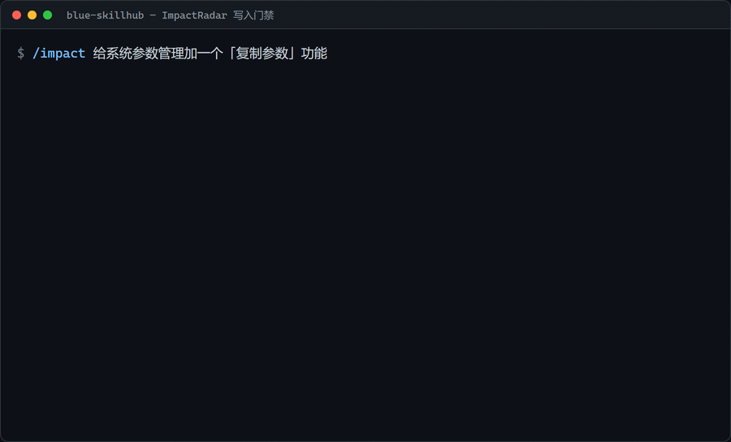
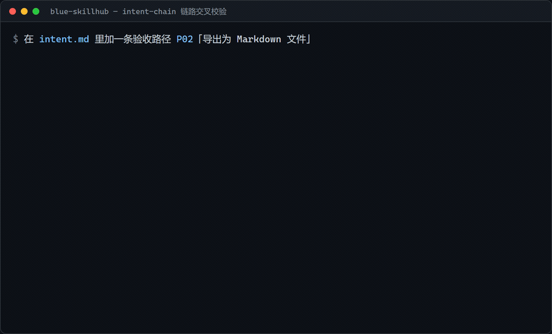
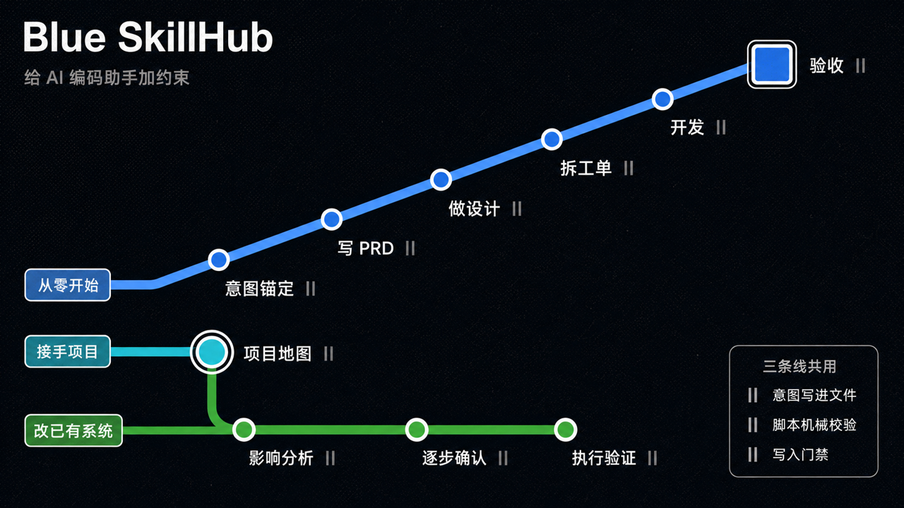
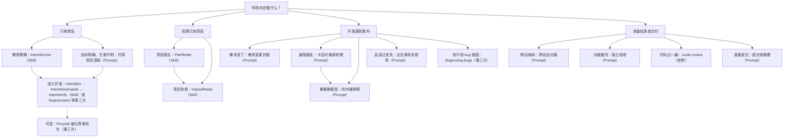

# Blue SkillHub

[](https://github.com/betterblueblue/blue-skillhub/actions/workflows/eval-checks.yml)
[](LICENSE)

Blue SkillHub 是一套面向 AI 编码助手的工作流工具。无论是把一个模糊想法说清楚、快速看懂陌生项目，还是修改已有系统，都有对应的工具可以使用。

开源模型已经能完成不少编码任务，但在长任务和高风险变更中仍不够稳定：它可能理解错需求、漏掉调用方、跳过验证，或者把尚未完成的工作说成已经完成。提示词是人与模型之间临时的接口，会话结束、上下文被压缩或换一个模型之后就接不上了；值得长期保存的不是那些文字，而是意图——什么结果算好，哪些代价不能接受，什么时候必须停下来让人确认。这个仓库不试图让模型变得更聪明，而是把容易丢失的意图、项目事实和执行状态写进文件，再让脚本检查其中能够自动验证的部分。所有产出的文档都面向两类读者：AI 能接着用，人也能直接看懂——结论用普通话写清楚，不把内部黑话丢给用户。

**改已有系统**用 ImpactRadar，它长这样——AI 分析完想动手，一句「都行，你定，继续吧」不算授权：



台词逐字取自[真实评测记录](eval/runs/real-projects/2026-07-27-sonnet-d21-style-trap/)。

**从零做新项目**走 intent-chain 八件套（视觉环节仅 UI 项目需要），它管的是另一件事——你确认过的东西，下游不能偷偷丢掉：



输出是 `chain_validate.py` 的实际运行结果。两张图都是重演而非屏幕录像，出处、完整输出和重新生成方法见 [docs/assets](docs/assets/)。

这三条线共用同一套底层机制——意图写进文件、脚本机械校验、写入门禁——它们的全景关系是这样：



## 先看这里：你现在遇到了什么情况？

不用先研究所有 Skill 和 Prompt。找到最接近你当前处境的一行，从推荐的入口开始即可。


```mermaid
flowchart TD
    A["你现在在做什么？"] --> B["只有想法"]
    A --> C["处理已有项目"]
    A --> D["开发遇到意外"]
    A --> E["准备结束或交付"]

    B --> B1["需求模糊：IntentAnchor（Skill）"]
    B --> B2["目标明确、方案不明：开源项目调研（Prompt）"]
    B1 --> B3["进入开发：IntentDev → IntentAdversarial → IntentVerify（Skill）或 Superpowers 等第三方"]
    B2 --> B3
    B3 -.-> B4["可选：Ponytail 强化简单优先（第三方）"]

    C --> C1["项目陌生：Pathfinder（Skill）"]
    C --> C2["项目熟悉：ImpactRadar（Skill）"]
    C1 --> C2

    D --> D1["需求变了：需求变更对账（Prompt）"]
    D --> D2["越改越乱：卡住时重新梳理（Prompt）"]
    D --> D3["需要换模型：找外援排障（Prompt）"]
    D --> D4["会话已丢失：无交接恢复现场（Prompt）"]
    D --> D5["找不到 bug 根因：diagnosing-bugs（第三方）"]
    D2 --> D3

    E --> E1["稍后继续：跨会话交接（Prompt）"]
    E --> E2["功能做完：独立验收（Prompt）"]
    E --> E3["代码过一遍：/code-review（自带）"]
    E --> E4["准备提交：提交前整理（Prompt）"]
```

图里括号标的是这一项的形态，也决定了你去哪里找它：

| 形态 | 是什么 | 在哪里 |
|---|---|---|
| **Skill** | 需要先安装，装好后在对话里用 `/技能名` 触发 | [skills/](skills/) 目录，安装方法见下面的「3 分钟上手」 |
| **Prompt** | 不用安装，打开文件把内容复制给 AI 就行 | [prompt/](prompt/) 目录 |
| **第三方** | 不属于本仓库，由各自作者维护，安装和用法以上游为准 | 节点里写的就是它的原名，见下文「想用第三方流程接手？」 |
| **自带** | AI 客户端本身提供的命令，不用装 | 见后文[代码评审](#代码评审)一节 |

最常见的六种处境，入口和去向如下：

| 你现在的处境 | 现在先做什么 | 用完以后 |
|---|---|---|
| 只有一个模糊想法，说不清给谁用、解决什么问题 | 用 [IntentAnchor](skills/intent-anchor/) 写出 `INTENT.md` | 按下方链路图走 intent-chain |
| 刚接手一个陌生仓库 | 用 [Pathfinder](skills/pathfinder/) 只读摸底 | 有具体改动时进入 [ImpactRadar](skills/impact/) |
| 已经熟悉项目，要加功能、修 Bug 或重构 | 用 [ImpactRadar](skills/impact/) 分析影响并逐步实施 | 完成后做独立验收和提交前整理 |
| 目标明确、方案不明 | 用 [开工前调研开源项目](prompt/open-source-project-research.md) | 看过证据并确认方案后再开发 |
| 开发卡住：需求变了 / 越改越乱 / 要换模型 / 会话丢了 | 从 [Prompt 工具箱](prompt/README.md) 找对应 Prompt | 按 Prompt 末尾的指引回到主流程 |
| 工单开发完，交付之前 | `/intent-adversarial` 对抗性验证 → `/intent-verify` 端到端验收 | 缺陷工单回 `/intent-dev` 修复闭环 |

以上没覆盖的处境，直接在会话里问 `/ask-blue`（路由技能），它会按你的情况指到对应入口、说明理由和下一步。完整的处境 → 入口 → 去向对照表就内建在它里面。

[律刃](skills/ruleblade/) 不属于某一个场景。它是一组可以在整个编码过程中常驻的行为规则，要求 AI 先弄清目标和上下文，再进行修改。

## 3 分钟上手

按你的场景选择最短路径。更完整的首次上手和排错指南（含"校验 FAIL 了怎么办"）见 [QUICKSTART.md](QUICKSTART.md)。

1. 安装。两种方式选一种，都装会得到两份重复的技能。

**方式一：Claude Code 插件（推荐）**。整套装好，仓库更新后一条命令升级：

```bash
claude plugin marketplace add betterblueblue/blue-skillhub
claude plugin install blue-skillhub@blue-skillhub
```

装好后就有：ask-blue（路由，不知道用哪个就问它）、律刃（ruleblade）、Pathfinder、ImpactRadar、intent-chain 八件套和 vl-vision。

**方式二：手动复制**。想直接改技能文件时用。克隆本仓库后在根目录执行：

```powershell
# 升级重装时必须先删旧目录再复制：Copy-Item 对已存在的目标目录会把新版嵌套进去，不会覆盖
"_common","ruleblade","pathfinder","impact","vl-vision","intent-anchor","intent-prd","intent-design","intent-visual","intent-issues","intent-dev","intent-adversarial","intent-verify" |
  ForEach-Object { Remove-Item "$env:USERPROFILE\.claude\skills\$_" -Recurse -Force -ErrorAction Ignore }

Copy-Item "skills\_common" "$env:USERPROFILE\.claude\skills\_common" -Recurse -Force
Copy-Item "skills\ruleblade" "$env:USERPROFILE\.claude\skills\ruleblade" -Recurse -Force
Copy-Item "skills\pathfinder" "$env:USERPROFILE\.claude\skills\pathfinder" -Recurse -Force
Copy-Item "skills\impact" "$env:USERPROFILE\.claude\skills\impact" -Recurse -Force
Copy-Item "skills\vl-vision" "$env:USERPROFILE\.claude\skills\vl-vision" -Recurse -Force
Copy-Item "skills\intent-anchor" "$env:USERPROFILE\.claude\skills\intent-anchor" -Recurse -Force
Copy-Item "skills\intent-prd" "$env:USERPROFILE\.claude\skills\intent-prd" -Recurse -Force
Copy-Item "skills\intent-design" "$env:USERPROFILE\.claude\skills\intent-design" -Recurse -Force
Copy-Item "skills\intent-visual" "$env:USERPROFILE\.claude\skills\intent-visual" -Recurse -Force
Copy-Item "skills\intent-issues" "$env:USERPROFILE\.claude\skills\intent-issues" -Recurse -Force
Copy-Item "skills\intent-dev" "$env:USERPROFILE\.claude\skills\intent-dev" -Recurse -Force
Copy-Item "skills\intent-adversarial" "$env:USERPROFILE\.claude\skills\intent-adversarial" -Recurse -Force
Copy-Item "skills\intent-verify" "$env:USERPROFILE\.claude\skills\intent-verify" -Recurse -Force
```

需要排查 Java OOM / 内存问题时，另装工具型 utility：

```powershell
Copy-Item "skills\whydump" "$env:USERPROFILE\.claude\skills\whydump" -Recurse -Force
```

> 说明：`whydump`（Java OOM 排查）和 `vl-vision`（识图）是工具型 utility，不属于核心 Skill、不参与评测体系；也可以不装，直接在仓库根目录用 `python skills/whydump/scripts/analyze.py <histo.txt>` 调用。注意：这种直接调用只适合手里已经有直方图文本（`jmap -histo` 的输出）的情况；正常排查从 `/whydump` 进，由它先引导取证、再调脚本。

Codex 用户把 `.claude\skills` 换成 `.codex\skills` 即可。其他安装方式见 [安装与验证清单](docs/install-and-verify-checklist.md)。

2. 根据任务选择入口。

如果还在构思 0→1 新产品，或者需求比较模糊：

```text
/intent-anchor
我想做一个帮助开发者整理跨会话工作进度的工具，但还没想清楚具体功能。
```

如果已经进入现有项目，需要先摸底或分析变更：

```text
/pathfinder
这个项目我刚接手，先帮我只读摸底。

/impact
我想删除 sys_user.remark 字段，先做影响分析，不要直接改代码。
```

`/intent-anchor` 不生成代码，只负责在头脑风暴或 PRD 之前产出 `INTENT.md`。`/impact` 支持 Java、Node.js、Python、Go 和前端项目等多种技术栈。如果已经熟悉项目结构，可以跳过 `/pathfinder`，直接使用 `/impact`。

3. 使用 ImpactRadar 改代码时，按步骤确认。

```text
确认 Step 2
```

只有明确回复 `确认 Step N` 才算授权。`继续`、`好的`、`全部确认` 都不算。Claude Code 用户可以启用 `.claude/hooks/impact-write-gate.*`，在工具执行前再次检查授权。

## 常用完整路线

下面是最常见的搭配，不要求每次把所有工具都走一遍。

- **从模糊想法开始做新项目**：律刃 → IntentAnchor → 需要时调研开源项目 → 用 IntentPRD 生成 PRD → 用 IntentDesign 做技术方案设计 → UI 项目用 IntentVisual 定视觉规范（无设计素材时）→ 用 IntentIssues 拆工单 → 用 IntentDev 开发 → 用 IntentAdversarial 对抗性验证 → 用 IntentVerify 端到端验收 → 提交前整理。也可以选择 Superpowers 或 Skills for Real Engineers 进入开发。担心 AI 把简单需求做复杂时，可以在开发阶段搭配 Ponytail。
- **接手陌生项目并准备修改**：律刃 → Pathfinder → 需求仍然模糊时使用 IntentAnchor → ImpactRadar → 独立验收 → 提交前整理。
- **熟悉项目中的明确改动**：律刃 → ImpactRadar → 验证 → 独立验收或提交前整理。不必为了流程完整强行运行 Pathfinder。
- **开发中途需求改变**：先暂停修改 → 需求变更对账 → 目标变化时回到 IntentAnchor，改动范围变化时回到 ImpactRadar。
- **问题久攻不下**：如果分不清哪些是事实、哪些是猜测，先卡住时重新梳理；如果 bug 本身很明确只是找不到根因，先用 diagnosing-bugs 造出可稳定复现的失败信号。有新线索就做一次针对性验证 → 仍无新方向时生成找外援材料并换模型。
- **跨会话继续工作**：旧会话生成 `HANDOFF.md` → 新会话读取并核对现场；没有交接文档时，改用无交接恢复现场。
- **实现完成准备交付**：如果 diff 已经说不清，先整理改动；如果改动范围清楚，先独立验收。想在提交前把代码质量也过一遍，用 `/code-review` 这类工具（注意别和链路已有的检查重复，见[代码评审](#代码评审)）。验收发现问题就返回实现环节，最终提交前再检查一次工作区。

## 从零开始开发

IntentAnchor 负责先把方向说清楚，"开工前调研开源项目"负责在技术路线不确定时查找依据。方向和方案确认以后，走 Blue SkillHub 自己的完整链路：

```text
intent-anchor → intent.md（意图、能力、验收路径、设计标准、术语表、性能/安全要求）
    ↓ 强制输入
intent-prd → prd.md（原生引用能力表和验收路径，验收标准用 Given/When/Then 结构）
    ↓ 强制输入
intent-design → architecture.md + design.md（架构决策外化为文件，假设表把过度设计变成显式决策）
    ↓ 按需（仅无设计素材的 UI 项目）
intent-visual → visual-design.md + visual-baseline.html（视觉规范与验收基线，登记进 INTENT 第 12 节激活既有截图门禁）
    ↓ 强制输入
intent-issues → issues.md（自动引用路径编号，自动检查覆盖；检查模块引用）
    ↓ 强制输入
intent-dev → dev-record.md（TDD 循环，每条 Then 按实际运行结果判定验证等级）
    ↓ 强制输入
intent-adversarial → adversarial-record.md（六类安全攻击实测 + 性能三步法压测 + CC 并发一致性断言；缺陷生成 FIX-* 工单）
    ↓ 强制输入
intent-verify → verify-record.md（全量回归 + 端到端验收路径 + 页面走查 + 条件性验证 + 缺陷清单 + 漂移复核 + 技术漂移复核）
```

### 链路的三个补充机制

- **IntentPRD 和 IntentIssues 改造自 Matt Pocock 的 [to-spec](https://github.com/mattpocock/skills/tree/main/skills/engineering/to-spec) 与 [to-tickets](https://github.com/mattpocock/skills/tree/main/skills/engineering/to-tickets)**（MIT，详见文末致谢）。改造的原因：原版不认识 `INTENT.md` 的结构，设计标准、术语表、验收路径、性能与安全要求只能靠交接 prompt 注入，下游不会主动检查约束是否被遵守。改造后两个技能原生解析 `INTENT.md` 各章节，IntentIssues 还会自动检查所有验收路径被至少一个工单覆盖。没有 `INTENT.md` 时，直接用原版 to-spec / to-tickets 即可。
- **轻量档**：小项目（用户可感知能力 ≤5、单用户、无数据库、无对外 API）可以在 intent-anchor 定档为轻量——文档薄写、确认合并、工单单条直行，但验收路径、假设表、V2 证据和全部校验器不降级。档位记录在 `INTENT.md` 第 2 节，只允许轻量升标准，不允许反向降档。
- **链路批量校验**：上游文档修订后，运行 `python skills/_common/chain_validate.py intent-chain/{链路目录}` 一条命令重验整条链——尚未产出的条件环节（如 visual-design.md）自动跳过；命令末尾还有两项跨文件检查：推迟或放弃的能力若回流到实现内容区会被拦下（D5 漂移检查），术语表登记过翻译的原始术语若出现在前端用户可见文案里也会被拦下（术语落地检查）。

各技能的完整机制、校验器检查项和常见问题，见 [docs/skills/](docs/skills/) 文档页（每个技能一页，固定四节）。

### 想用第三方流程接手？

- [Superpowers](https://github.com/obra/superpowers)：覆盖需求澄清、设计确认、实施计划、TDD 和多 agent 分工开发，适合不想自己编排每个开发环节的人。可以先把 `INTENT.md` 和开源调研结果交给它；已经用 IntentAnchor 问清需求时，不必再同时运行两套内容相近的需求访谈。
- [Skills for Real Engineers](https://github.com/mattpocock/skills)：提供 grill-with-docs、to-spec、to-tickets、implement、tdd、code-review 等可单独选择和组合的技能，适合希望自己掌控开发节奏的人。grill-with-docs 和 IntentAnchor 都会深入追问需求，选一个作主入口即可。
- [Ponytail](https://github.com/DietrichGebert/ponytail)：把"简单优先"变成一套检查顺序——这个功能是否真的需要 → 项目里是否已有实现 → 标准库或平台是否已提供 → 最后才编写所需的最少代码。它和前两者的分工：**律刃**规定通用编码行为（不加需求外的功能、只改必须改的），**ImpactRadar**管已有系统变更（该改的不能漏、不相关的不要顺手改），**Ponytail**管实现前的复用取舍。模型已稳定遵守律刃时不必叠加；仍习惯重新造轮子或过度设计时再考虑。它不能代替需求确认、设计、测试、安全和验收。

这三个项目都由各自作者独立维护，不属于 Blue SkillHub。具体支持哪些 AI 客户端、怎样安装以及当前版本能力，请以上游仓库的最新说明为准。

## 三个核心 Skill 怎么分工

三项核心 Skill 可以独立使用，也可以按上面的路线配合。

| Skill | 什么时候用 | 主要作用 |
|---|---|---|
| **IntentAnchor** | 只有一个模糊想法，还没形成 PRD；也适用于系统转换和已有系统新增能力 | 把要做什么、不做什么和不可妥协项整理成 `INTENT.md` |
| **Pathfinder** | 刚接手一个不熟悉的现有项目 | 只读梳理技术栈、模块、入口、数据和风险区域，产出项目地图 |
| **ImpactRadar** | 准备修改已有系统，特别是模型容易漏步骤或任务本身风险较高时 | 分析改动会影响哪些代码、接口、数据和测试，并用严格门禁监督实施 |

这套工具不负责一键搭建完整系统。对于 0→1 项目，IntentAnchor 先帮你把方向说清楚，后续实现可以参考上面的第三方工具；面对已有代码时，可以用 Pathfinder 摸清项目，再由 ImpactRadar 分析并执行改动。

## 写完代码之后：评审与排查

代码评审和 bug 排查这两件事，本仓库没有做，也不打算做——现成的工具已经够用。这里说明两点：它们在哪里，以及哪一部分和本仓库重复了，不用两套都上。

### 代码评审

**先说一个很多人不知道的事：Claude Code 自带 `/code-review`，不用安装。** 它对当前改动做评审，查正确性 bug 和可以复用、简化的地方，可以按 low / medium / high / max 选强度（越高查得越广，但也会带上一些不太确定的结论），最高一档会派多个 agent 分头查。加 `--fix` 直接把结论应用到工作区，加 `--comment` 发成 PR 行内评论。另外还有 `/security-review` 专查安全问题，`/simplify` 只做简化不查 bug。这几个是 Claude Code 的命令，Codex 用户没有。

如果想要一份可以自己修改的评审规则，可以用 Matt Pocock 的 [code-review](https://github.com/mattpocock/skills/tree/main/skills/engineering/code-review)（出自 [Skills for Real Engineers](https://github.com/mattpocock/skills)）。它从两个角度看代码：**写得规不规范**，以及**做出来的是不是当初说好的**。

**这里要注意和本仓库的重复**：上面第二个角度——做出来的是不是当初说好的——正是 intent-chain 和 ImpactRadar 已经在做的事，只是做法不同。第三方 Skill 是让模型读一遍代码给结论；本仓库是用校验脚本机械比对能力表、验收路径和模块引用，再由 IntentVerify 逐条走通用户路径确认。**两种选一种即可**，同时用只是重复劳动。

真正需要另外补的是第一个角度：代码本身写得好不好。这方面本仓库确实没有覆盖，用自带的 `/code-review`，或者项目里已经配好的 SonarQube、Checkstyle、ESLint 这类工具都可以——不建议自己造，这些都是成熟工具。

### 问题排查

[diagnosing-bugs](https://github.com/mattpocock/skills/tree/main/skills/engineering/diagnosing-bugs) 同样来自 Matt Pocock 的 [Skills for Real Engineers](https://github.com/mattpocock/skills)（有的版本装完名字是 `diagnose`），是一套排查硬 bug 的流程：复现 → 缩小范围 → 提假设 → 加观测 → 修 → 补回归测试。

它最值得借鉴的是第一步：**先想办法造出一个快、稳定、AI 能自己反复跑的通过/失败信号**，然后再谈别的。有了这个信号，二分查找、验证假设、加日志都只是在消费它；没有这个信号，盯着代码看再久也找不出来。造信号的办法按优先级大致是：写一个会失败的测试 → curl 打接口 → 命令行跑固定输入比对输出 → 用 Playwright 驱动浏览器 → 回放抓下来的真实请求 → 搭一个最小复现环境。

本仓库的 [卡住时重新梳理](prompt/stuck-reassessment.md) 和它不冲突，用途不一样：那个用于"改了好几轮越来越乱，已经分不清哪些是事实、哪些是猜测"，先把局面理清楚；`diagnosing-bugs` 用于"有一个明确的 bug，但找不到根因"。

### 一句提醒

测试全绿不代表代码没问题。AI 完全可能在正确实现功能的同时，顺手加进一些多余、危险或者以后没法维护的东西。改动涉及支付、权限、隐私和生产数据时，人工看一眼这一步省不掉——评审工具能减少要看的量，不能代替看。

## 里面有什么

### 技能一览

[docs/skills/](docs/skills/) 里有每个随插件发布的技能的独立文档页，固定四节：它做什么、什么时候用、常见问题、用对了是什么样子。想快速了解某个技能先看文档页，机制细节再看技能目录里的 SKILL.md。

| 技能 | 一句话 | 文档 |
|---|---|---|
| ask-blue | 路由：不知道用哪个就问它 | [docs/skills/ask-blue.md](docs/skills/ask-blue.md) |
| IntentAnchor | 模糊想法 → `INTENT.md` | [docs/skills/intent-anchor.md](docs/skills/intent-anchor.md) |
| IntentPRD | `INTENT.md` → PRD | [docs/skills/intent-prd.md](docs/skills/intent-prd.md) |
| IntentDesign | PRD → 架构与功能设计文档 | [docs/skills/intent-design.md](docs/skills/intent-design.md) |
| IntentVisual | 无设计素材的 UI 项目 → 视觉规范与验收基线 | [docs/skills/intent-visual.md](docs/skills/intent-visual.md) |
| IntentIssues | 按垂直切片拆工单，验收路径全覆盖 | [docs/skills/intent-issues.md](docs/skills/intent-issues.md) |
| IntentDev | 逐工单 TDD 开发，真实运行证据才能标 done | [docs/skills/intent-dev.md](docs/skills/intent-dev.md) |
| IntentAdversarial | 安全攻击实测 + 并发断言 + 性能压测 | [docs/skills/intent-adversarial.md](docs/skills/intent-adversarial.md) |
| IntentVerify | 端到端验收 + 漂移核对 | [docs/skills/intent-verify.md](docs/skills/intent-verify.md) |
| ImpactRadar | 已有系统变更影响分析 + 受监督实施 | [docs/skills/impact.md](docs/skills/impact.md) |
| Pathfinder | 陌生项目只读摸底出项目地图 | [docs/skills/pathfinder.md](docs/skills/pathfinder.md) |
| VL 识图 | 让看不了图的模型能读截图和设计稿 | [docs/skills/vl-vision.md](docs/skills/vl-vision.md) |
| 律刃 | 常驻行为规则装进项目 | [docs/skills/ruleblade.md](docs/skills/ruleblade.md) |

### 谁更需要 ImpactRadar 的严格门禁

ImpactRadar 会生成分析文档、要求逐步确认并运行自动检查。这些限制能减少漏改和提前宣布完成，但也会增加时间和交互成本，因此不适合不加判断地用于每一次修改。

- **能力较弱、速度优先或成本较低的模型**：更建议默认使用。模型越容易跳过上下文、漏查调用方或把未验证工作说成完成，门禁带来的帮助越明显。
- **Claude Opus 或同等级 GPT 模型**：处理边界清楚、风险较低的普通改动时，不建议默认使用完整的 ImpactRadar 流程。通常遵守律刃并直接完成针对性验证即可；仍想保留影响检查时，可以使用 `light` 模式。
- **任何模型面对高风险任务时**：仍建议使用。数据库结构和数据迁移、公开接口、权限、状态机、跨模块改动以及跨会话长任务的风险，不会因为模型更强就消失。

判断重点不是单看模型名称，而是同时看模型是否容易漏步骤、改动能否轻易撤销，以及出错后会影响多少用户和数据。

### Prompt 工具箱

[prompt/](prompt/)

遇到具体麻烦时可以直接发给 AI 的指令，覆盖开工前调研、开发卡住、需求变化、会话切换、独立验收和提交前整理。上方的场景表可以帮你找到入口；各 Prompt 的选择边界和复制方法见 [Prompt 工具箱说明](prompt/README.md)。

### 律刃

[skills/ruleblade/](skills/ruleblade/)

写给 AI 编码助手的常驻行为规则：8 条编码规则、1 条评审与迭代纪律、1 条中文表达要求，放进项目的 `CLAUDE.md`（Codex 用 `AGENTS.md`）。律刃最初参考了 multica-ai/andrej-karpathy-skills 的 [CLAUDE.md](https://github.com/multica-ai/andrej-karpathy-skills/blob/main/CLAUDE.md)，后经多轮跨模型稳定性复测演进到 v3.4，记录见 [律刃 README](skills/ruleblade/README.md)。安装插件后在对话里运行 `/ruleblade` 也能装进目标项目。

### 网搜 MCP

[mcp/web-search-mcp/](mcp/web-search-mcp/)

为支持 MCP 的 AI 客户端提供网页搜索。它支持 Google、Bing、Brave 和 DuckDuckGo，既可以只返回搜索摘要，也可以继续打开网页提取正文。Cursor、CodeBuddy 和 Claude Desktop 等客户端都能接入。

### VL 识图

[skills/vl-vision/](skills/vl-vision/)

一个通用的图片理解工具。提供图片和分析模板后，它会调用视觉模型返回结构化结果，适合为只支持文本的 AI 补充图片分析能力。

## 维护与评测（面向改进这套技能的人）

### 统一测评体系

详细设计见 [docs/skill-eval/](docs/skill-eval/) 与 [eval/](eval/)，本节只留框架。

测试分三层：**L0 静态检查**（`bash skills/<skill>/tests/run.sh`，零模型费用）、**L1 行为测试**（`bash eval/run-l1.sh <skill>`，让另一个 AI 扮演用户执行用例后自动评分并检查安全规则）、**L2 人工抽查**。每次修改 Skill 后，L1 生成评分卡并与上一版基线逐用例比较——原本通过的规则变为失败、任一维度下降 3 分及以上、或新增 P0/P1 问题，这一版就不能发布。

真实项目测试放在 [eval/real-projects/](eval/real-projects/)，覆盖 Java 后端、Node API、Python 全栈、前端以及 monorepo/非 Git 共 5 类项目。这里不采信模型自己报告的结果，以独立重跑检查脚本和实际文件为准（[测试手册](eval/real-projects/runbook.md)）；历次绕过流程或检查的手段记录在 [问题记录](eval/real-projects/escape-ledger.md)（E-001 到 E-010，每类都有对应的自动检查或明确的边界说明）。目的不是证明模型不会出错，而是确认错误能否被及时发现。

**一次真实项目实测（2026-07-26）**：用户本人操作、模型用 Sonnet 5（比旗舰弱一档），按 intent-chain 六件套从需求做到验收，一晚上交出一个可运行的企业信息撮合平台——后端 288 + 前端 46 个测试全绿，17 条用户路径在浏览器里实际走通，校验脚本 7/7 通过。过程中发现的问题和修法都写在了 [实测报告](docs/graduation-exam-2026-07-26.md) 里，不是只报好消息。

模型结论只代表当时的测试范围：截至 2026-07-04 的 56 条测试中，Composer 2.5 Fast 是 Pathfinder 与 ImpactRadar 表现最稳定的低成本模型（22 条结果：9 PASS / 7 GATE-RECOVERED / 3 PASS-WARN / 2 FAIL / 1 UNVERIFIED），数据见 [2026-07-04 测评汇总](docs/handoff-summary-2026-07-04.md)。后续待处理问题见 [Skill 改进清单](docs/skill-iteration-backlog.md)。

### 项目跑完之后：Skill 体系的复盘与回流

上面说的都是「这个项目做得对不对」，还有一层是「**做出这个项目的 Skill 体系本身对不对**」。每个完整跑完意图链路的项目，都是对这套 Skill 的一次实战检验——租衣摄影项目一轮就暴露了 20 个链路缺陷（验收环节缺失、页面清单没锚定、缺对抗性验证、缺缺陷闭环），全部已修复，但修复是否有效要靠下一个项目验证。

复盘与回流的完整流程见 [`_improvements/`](_improvements/)，两个入口：

- **项目开始时**：把 [`_improvements/VALIDATION-PROMPT.md`](_improvements/VALIDATION-PROMPT.md) 的引导词贴进会话——项目会话会在推进的同时执行 6 张验证卡的检查。
- **项目跑完后**：把 [`_improvements/REVIEW-PROMPT.md`](_improvements/REVIEW-PROMPT.md) 的引导词贴进新会话——它会补验、登记新问题（按归因三分类：校验器缺口 / SKILL 指引不够 / Agent 违反指引）、更新 [`STATUS.md`](_improvements/STATUS.md) 聚合状态，并按归因直接执行修复。

验证任务卡和验证报告清单见 [`verification-cards.md`](_improvements/verification-cards.md) 与 [`verifications/`](_improvements/verifications/)。归因分布的逐轮趋势是判断体系健康度的核心信号：「校验器缺口」占比应逐轮下降，若「Agent 违反指引」持续高位，说明剩余约束必须全部下沉为校验器。

### 研究与实验记录

Not ACE 上下文检索实验、多模型测试、历史案例复盘等研究材料，已移至 [docs/research.md](docs/research.md)。

## 致谢

IntentPRD 和 IntentIssues 改造自 Matt Pocock 的 [to-spec 和 to-tickets](https://github.com/mattpocock/skills)（早期版本叫 to-prd / to-issues）。原项目以 MIT 许可发布，版权归原作者所有；本仓库在其基础上改成原生解析 `INTENT.md`，并补上验收路径编号引用、覆盖检查和配套校验脚本。

律刃最初参考了 multica-ai/andrej-karpathy-skills 的 [CLAUDE.md](https://github.com/multica-ai/andrej-karpathy-skills/blob/main/CLAUDE.md)，后来根据中文编码任务和复杂变更测试不断调整。

"改代码前先查调用方和引用方，找到后再判断哪些必须同步修改"来自 [hxd-ggsddu](https://github.com/hxd-ggsddu) 提交的 GitHub issue。律刃和 ImpactRadar 都采纳了这项建议，以减少遗漏接口、生成文件、测试或注册位置的情况。

ImpactRadar 的长期任务、暂停后恢复、接口返回检查、验证等级、多会话授权和写入路径限制，也参考了 [hxd-ggsddu](https://github.com/hxd-ggsddu) 提供的真实案例。这些案例帮助发现了长会话、多步骤迁移、非 Git 项目和延迟确认中的问题。

## 安装后自检

装完想确认一切正常？按 [安装与验证清单](docs/install-and-verify-checklist.md) 逐节走一遍：律刃、Pathfinder/Impact、intent-chain、网搜 MCP、VL 识图的安装验证和常见踩坑都在里面，含中断恢复的正确交互示例。使用中的几条硬边界：`intent-anchor` 只产出 `INTENT.md` 不写代码；`pathfinder` 只读，只写自己的地图和 facts 文件；`impact` 的所有写操作必须等用户明确回复 `确认 Step N`（`yes`、`继续`、`全部确认`都不算）；会话中断后 `_active-state.md` 只帮助恢复进度，不能当作新的写入授权。

## 常见问题（FAQ）

- **Codegraph MCP 显示已连接，但没有可用工具（No tools）**：通常是因为直接运行全局 `serve --mcp` 时，没有找到项目根目录中的 `.codegraph/` 索引。项目级启动脚本、`--path` 参数和 4 个工具的检查方法见 [Codegraph 排查说明](docs/install-and-verify-checklist.md#codegraph-mcp-显示已连接但没有工具no-tools)。

  即使 MCP 不可用，Pathfinder 和 ImpactRadar 也会改用普通的文件读取和搜索工具，基本流程不受影响。

## 目录速览

```text
blue-skillhub/
├── .claude/
│   └── hooks/                # 推荐启用的 Claude Code 写入前检查
├── .claude-plugin/           # Claude Code 插件清单（plugin.json + marketplace.json）
├── prompt/                   # 可直接复制使用的 Prompt
├── docs/
│   ├── skills/               # 每个技能一页的四节文档
│   ├── adr/                  # 重大决定的"当初为什么"备忘卡片
│   ├── skill-eval/           # 测评体系说明
│   ├── research.md           # 研究与实验记录
│   ├── install-and-verify-checklist.md
│   └── archive/              # 历史文档与设计复盘
├── eval/                     # 测试用例、历史结果和评分基线
│   ├── cases/<skill>/        # 可重复运行的测试用例
│   ├── runs/                 # 各次运行的评分卡
│   ├── baselines/            # 当前基线指针
│   ├── real-projects/        # 真实项目回归测试与问题记录
│   └── scripts/              # 评分与基线对比脚本
├── mcp/
│   └── web-search-mcp/
└── skills/
    ├── _common/              # 共享校验器与共享规则 rules.md
    ├── ask-blue/             # 路由：不知道用哪个就问它
    ├── pathfinder/
    ├── impact/
    ├── intent-anchor/        # intent-chain 八件套（含 intent-prd / design /
    ├── intent-prd/           #   visual / issues / dev / adversarial / verify）
    ├── ruleblade/            # 律刃行为规则
    ├── vl-vision/
    ├── whydump/              # Java OOM 排查（utility，不进插件）
    └── wordmirror/           # 用户画像（utility，不进插件）
```
