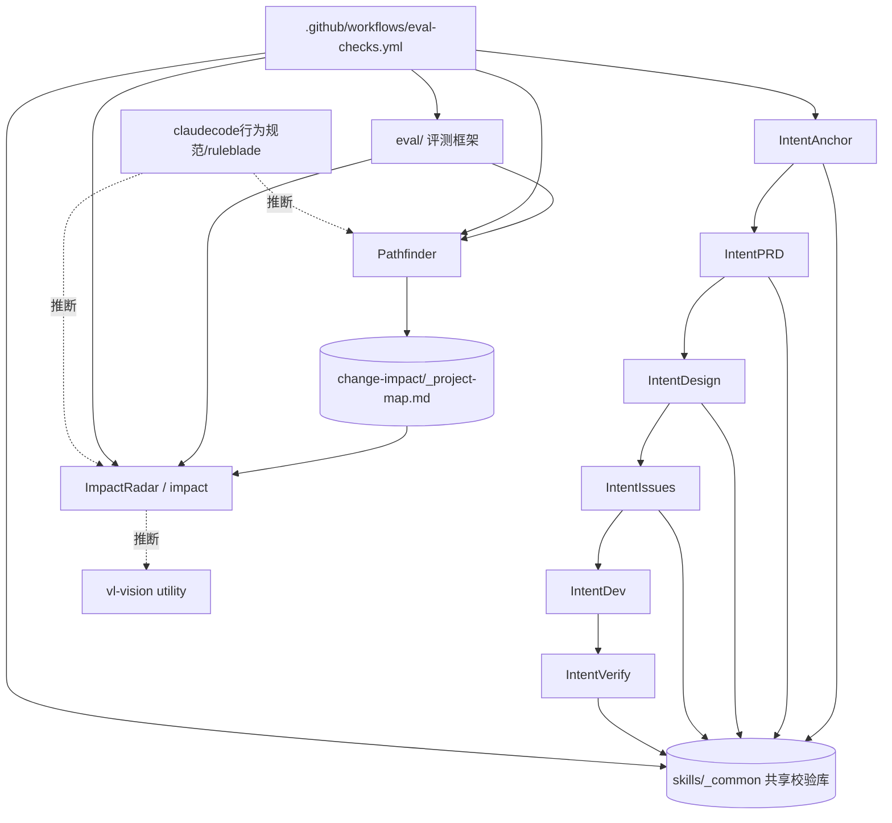

# Blue SkillHub 项目结构总览

> 本地图由 Pathfinder(领航)生成,供 impact 当 L1 导航上下文。
> 地图只是**导航参考，不是权威依据**:`【推断】`项动手前必须重新取证。

## 概览摘要（30 秒读懂）

> 本节为人类快速认知设计。impact 读取时跳过本节,从【0】开始。

**一句话**：Blue SkillHub 是一套面向 AI 编码助手(Claude Code / Codex)的 Agent Skills 集合与自建评测框架,核心产品是三条能力线——IntentAnchor 六件套(0→1 需求到验收全链路)、Pathfinder(陌生项目摸底)、ImpactRadar/impact(现有系统变更影响分析与受监督实施)——外加一套用真实开源项目回归测试这些技能质量的 eval/ 框架。
证据：【已核实: README.md:1-3,7-9 定位陈述;skills/ 目录下 11 个技能包;eval/real-projects/README.md 明确以 Pathfinder 和 ImpactRadar 为测试对象】

**Quick Start（5 步跑起来）**：
1. 克隆本仓库,确认本机有 Python 3(`python --version`)——【已核实: QUICKSTART.md:5-9】
2. 把要用的技能复制进客户端技能目录：`Copy-Item "skills\pathfinder" "$env:USERPROFILE\.claude\skills\pathfinder" -Recurse -Force`（Codex 换 `.codex\skills`；升级重装需先删旧目录,见下方 Gotchas）——【已核实: QUICKSTART.md:13-22】
3. 重启客户端,确认 `/pathfinder`、`/impact` 能被识别——【已核实: QUICKSTART.md:24】
4. 在目标项目里输入 `/pathfinder` + "这个项目我刚接手，先帮我只读摸底。"（本地图正是这个例子在本仓库自己身上跑出来的产出）——【已核实: QUICKSTART.md:30-33】
5. 产出写到目标项目的 `change-impact/_project-map.md`,写入前自动跑 `pf_validate.py`(11 项检查),不通过不写入——【已核实: QUICKSTART.md:37-40】

> 本仓库本身没有"启动服务"这一步——它不是被运行的应用,而是被 AI 编码助手读取识别的技能定义集合。【已核实: 仓库根目录无 package.json】

**从这 5 个文件开始读**：

| 文件 | 为什么重要 | 可信度 |
|------|-----------|--------|
| `README.md` | 场景路由表,告诉你当前处境该用哪个工具 | 【已核实: README.md:7-55】 |
| `QUICKSTART.md` | 5 分钟上手,含安装命令和两个可复现例子 | 【已核实: QUICKSTART.md 全文 78 行】 |
| `skills/pathfinder/SKILL.md` | 本地图产出所依据的技能定义本身 | 【已核实: 全文 289 行】 |
| `skills/impact/SKILL.md` | 另一条主线,15 条强制规则定义写操作确认边界 | 【已核实: SKILL.md:1-70】 |
| `HANDOFF.md` | 当前开发状态与未完成事项的交接记录 | 【已核实: HANDOFF.md:1-40】 |

> 注：草稿校验期间(Phase 1.5 首次取证之后、Script Gate 通过之前)仓库 HEAD 从 `c72ffd7` 前进到 `ad7bb61`(另一次真实 commit,`fix(docs): 安装命令补升级守卫`,改了 `QUICKSTART.md`/`README.md`/`docs/install-and-verify-checklist.md` 三个文件)。已按 Phase 5 刷新规则重跑 `pf_scan.py`/`pf_git.py`,并核对该 commit 具体改动是否影响本地图已引用的行号(结论:`README.md` 改动点在本地图引用范围之后不受影响;`QUICKSTART.md` 改动点在本地图引用范围之前,已重新核实并更正全部相关行号)。

**Top 3 风险**：
1. `.gitignore` 里 `!skills/impact/tests/e2e/` 例外规则因缺少对父目录 `skills/impact/tests/` 本身的例外声明而实际不生效,e2e 场景定义和仿真工作目录未被追踪入库 — 【已核实: .gitignore:11,22;`git check-ignore -v` 命中第 11 行而非第 22 行】
2. CI 的 SKILL.md frontmatter 校验要求所有 `skills/*/SKILL.md` 含 `allowed-tools` 字段,`skills/vl-vision/SKILL.md` 没有该字段 — 【已核实: .github/workflows/eval-checks.yml:73,87;skills/vl-vision/SKILL.md:1-7】
3. `impact-write-gate` hook(写操作前置确认拦截)在本仓库自己的 `.claude/settings.local.json` 中未启用,推荐的事中硬拦截层当前处于关闭状态 — 【已核实: .claude/settings.local.json 全文 8 行,无 hooks 字段;skills/impact/SKILL.md:13 建议启用该 hook】

**Top 3 Gotchas**：
1. 仓库根目录存在与 `test-projects/ruoyi-vue/`(真实若依项目克隆,含 pom.xml 和自己的 .git)同名的 `ruoyi-vue/` 目录,但内容只是两层空文件夹(`change-impact/blind-v4-step37flash/{B1,B2}`),不含任何项目源码 — 容易被误认成同一个东西
2. `mcp/`(单数,真实 vendor 进来的 web-search-mcp 服务器编译产物)和 `mcps/`(复数,已 gitignore 的本地 MCP 工具 schema 缓存)是完全不同的两个目录,仅名字相似
3. 根目录 `CLAUDE.md` 与 `claudecode行为规范/ruleblade/CLAUDE.md` 逐字节相同——本次会话开头注入的项目规则,就是这个仓库自己的产品(RuleBlade)在自己身上生效

**导航**：→ 【3】架构分层 / 【6】数据模型 / 【8】构建运行 / 【11】主流程 / 【13】未覆盖项

---

## 【0】基本信息(可信度标记)

```
生成时间: 2026-07-26（真实系统时间,详见下方命令产出）
基于 commit: ad7bb61
预算档位: 大仓(跟踪文件 808)
关注重点: 无,均匀全景(用户仅说"刚接手,先只读摸底",按 Phase 0 降级规则不裁剪广度)
覆盖范围:
  已深入: skills/ 11 个技能包的结构模式与依赖关系、pathfinder 与 impact 的完整硬性规则、_common 共享校验库、eval/ 内部六个子目录分层、.claude/(hooks+workflows+权限配置)、mcp/ vs mcps/ 的区分、CI 全部 12 个步骤、根目录三份文档(README/QUICKSTART/HANDOFF)、Python 测试框架与 CI 覆盖缺口、.gitignore 全部规则
  未深入: intent-design/intent-dev/intent-issues/intent-prd/intent-verify 各自 SKILL.md 正文细节(只核实了 frontmatter 和"是否有强制规则章节")、docs/ 下 88 个文件的绝大多数(仅读了目录结构和 skill-eval/ 子目录用途)、eval/real-projects 下具体测试用例内容、mcp/web-search-mcp 除入口注册外的实现细节、vl-vision 的 providers/ 具体实现
结构索引辅助:
  status: used
  tool: mcp__codegraph__codegraph_explore
  query: "project overview entry points pathfinder impact skills structure"
  coverage: scoped(1/2 次调用预算,返回 102 个符号/28 个文件,含高价值命中但多数是索引到的第三方 fixture 噪音)
  verified_by:
    - Read skills/impact/scripts/impact_validate.py:2203-2266（V22 check_pathfinder_consumption,codegraph 输出即真实源码,已视为已读）
  downgrade_reason: 该 MCP 索引范围覆盖磁盘物理文件(含 test-projects/、eval/archive/ 等已 gitignore 的第三方项目,共 4182 个文件索引),不区分 git 追踪范围,广域查询噪音较高;本仓库以 Markdown/配置为主而非深层调用链代码,后续改用 Read/Grep/子 agent 直接扫描更高效
```

## 【1】一句话概述

- 这是个什么项目、给谁用、解决什么问题：Blue SkillHub 是一套给 AI 编码助手用的工作流工具集——把"容易在长任务里丢失的意图、项目事实和执行状态"写进文件,再用脚本做机械校验,覆盖从模糊想法到验收交付的全过程,并自建评测框架持续验证这些工具本身的质量。
- 证据：`【已核实: README.md:5 "这个仓库不试图让模型变得更聪明,而是把容易丢失的意图、项目事实和执行状态写进文件,再让脚本检查其中能够自动验证的部分"】`

## 【2】技术栈

| 维度 | 内容 | 可信度 |
|------|------|------|
| 语言 | Markdown(技能定义/文档,450 个追踪文件,占比最大)、Python(校验脚本,45 个)、TypeScript/JavaScript(mcp/web-search-mcp 编译产物 + .claude/workflows 驱动脚本) | 【已核实: change-impact/_project-map/facts/scan.json file_ext_counts】 |
| 主框架 | 无传统应用框架——这是 Claude Code / Codex 的 Agent Skills 格式(YAML frontmatter + Markdown 正文),按各客户端 skills 目录约定加载 | 【已核实: 全部 SKILL.md 起始 YAML frontmatter 结构一致】 |
| 构建工具 | 无整体构建;`mcp/web-search-mcp` 只有 `npm start`(`node ./dist/index.js`),没有 build 脚本,仓库内也没有对应 TypeScript 源码 | 【已核实: mcp/web-search-mcp/package.json scripts 字段仅 start 一条】 |
| 数据库 | 无——本仓库不是数据库驱动应用,详见【6】 | 【已核实: 全仓库 git 追踪范围内 grep .sql/.prisma/migrations 均为空】 |
| 关键依赖 | `@modelcontextprotocol/sdk`、playwright、cheerio(mcp/web-search-mcp);pyyaml(CI 校验 SKILL.md frontmatter) | 【已核实: mcp/web-search-mcp/package.json;.github/workflows/eval-checks.yml:44,70】 |

> monorepo 说明:顶层按"技能包(skills/)+ 评测框架(eval/)+ 独立 MCP 服务器(mcp/)+ 文档/规则产品(docs/、claudecode行为规范/、prompt/)+ 第三方测试 fixture(test-projects/,已 gitignore)"分区,各区技术栈相互独立。嵌入的第三方 fixture(不属于本体)另涉及 Java/Spring Boot(RuoYi-Vue)、Node/Express/Prisma、Python/FastAPI、Go(go-admin)等多种栈,仅用于 eval/impact/pathfinder 的真实项目回归测试。

## 【3】架构分层 / 模块地图  ← 供 impact 作 L1 上下文

| 模块 / 目录 | 推断职责 | 相关性 | 可信度 |
|-------------|----------|--------|------|
| `skills/` | 核心产品:11 个技能包(impact/pathfinder/intent-anchor/intent-design/intent-dev/intent-issues/intent-prd/intent-verify/vl-vision/_common/blue-interview) | 3 | 【已核实: git ls-files skills/ 计 169 个文件】 |
| `skills/impact/` | 现有系统变更影响分析 + 受监督实施,15 条强制规则,当前改动最活跃 | 3 | 【已核实: SKILL.md 全文;git.json hotspots 前 10 里占 5 席】 |
| `skills/pathfinder/` | 陌生项目只读摸底,产出本地图 | 3 | 【已核实: SKILL.md 全文;git.json hotspots 前 10 里占 3 席】 |
| `skills/intent-anchor/intent-prd/intent-design/intent-issues/intent-dev/intent-verify/` | 0→1 需求到验收的六段式链路(意图澄清→PRD→架构设计→工单拆分→TDD 开发→整体验收) | 3 | 【已核实: 各 SKILL.md frontmatter description 字段自述输入输出契约】 |
| `skills/_common/` | 六件套共享校验库(chain_validate.py/d5_check.py/markdown_parser.py),intent-dev 除外的 5 个校验脚本靠 sys.path 注入引用 | 2 | 【已核实: skills/intent-anchor/scripts/intent_validate.py:38】 |
| `skills/vl-vision/` | 独立 utility:调用外部视觉模型 API 识图,自称不参与技能评测体系 | 1 | 【已核实: skills/vl-vision/SKILL.md:1-13】 |
| `skills/blue-interview/` | 面试辅导技能,本地存在但未入库(待开源) | 1 | 【已核实: .gitignore:8】 |
| `eval/` | 评测框架,专门验证 impact 和 pathfinder 质量,仓库内最大目录(467 个追踪文件) | 2 | 【已核实: eval/real-projects/README.md 明确以 Pathfinder/ImpactRadar 为测试对象;CI 多步骤调用】 |
| `docs/` | 项目管理/决策记录文档,子目录 `skill-eval/` 存评测方法论(rubric/release-gate) | 1 | 【已核实: git ls-files docs/ 计 88 个文件】 |
| `claudecode行为规范/ruleblade/` | RuleBlade v3.4,独立编码行为规则产品,可单独用也可配合 IntentAnchor/Pathfinder/ImpactRadar | 2 | 【已核实: 根目录 CLAUDE.md 与 claudecode行为规范/ruleblade/CLAUDE.md 内容一致(diff 无输出)】 |
| `prompt/` | 8 个即用型场景化 prompt,不需要安装技能,直接复制给 AI 助手用 | 2 | 【已核实: README.md:44,48-54 多处引用 prompt/ 下具体文件】 |
| `mcp/web-search-mcp/` | 真实 vendor 进仓库的 MCP 服务器编译产物,fork 自 mrkrsl/web-search-mcp 并做中文场景本地化 | 2 | 【已核实: mcp/web-search-mcp/package.json;dist/index.js 注册 3 个工具】 |
| `mcps/`（复数） | 本地 MCP 工具 schema 缓存 + IDE 启动配置,整体 gitignore,非仓库交付内容 | 0 | 【已核实: .gitignore:5;git ls-files mcps/ 为空】 |
| `.claude/` | 本仓库自己的 Claude Code 配置:写保护 hook(未启用)、4 个评测 workflow 驱动脚本、权限白名单 | 2 | 【已核实: .claude/settings.local.json 全文;.claude/hooks/、.claude/workflows/ 目录内容】 |
| `.github/workflows/` | CI:单一 workflow,把 eval/、impact、pathfinder、intent-anchor、_common 的测试串成一条流水线 | 2 | 【已核实: eval-checks.yml 全文 96 行】 |
| `scripts/` | 顶层脚本:`sync_templates.py`(CI 用于校验 impact/templates/ 完整性) | 1 | 【已核实: scripts/sync_templates.py】 |
| `test-projects/` | 第三方开源项目克隆集合(RuoYi-Vue、go-admin、多个 realworld-*/springboot-* 模型对比变体等),整体 gitignore,供 eval/impact/pathfinder 拿真实项目回归测试 | 1 | 【已核实: .gitignore:24;抽查 3 个子目录均有独立 .git】 |
| `ruoyi-vue/`(根目录) | 历史残留空壳,只剩 `change-impact/blind-v4-step37flash/{B1,B2}` 两层空文件夹,不含项目源码,与同名的 `test-projects/ruoyi-vue/` 不是一回事 | 0 | 【已核实: find ruoyi-vue -type f 无输出;test-projects/ruoyi-vue 有独立 .git 和 pom.xml】 |
| `change-impact/`(根目录) | 历史残留:一份 `_project-map.md.broken`(21462 字节,内容实为另一次对 test-projects/prisma-express-ts 的盲测产出,写错了输出路径)+ 本次运行刷新前的旧 facts JSON(同样指向 prisma-express-ts,已被本次 Phase 1.5 覆盖为本仓库自己的事实) | 0 | 【已核实: change-impact/_project-map.md.broken 存在;覆盖前的 facts/git.json 曾记录 toplevel 为 test-projects/prisma-express-ts】 |

**架构图**(只画有证据的边;实线 = 【已核实】依赖,虚线 = 【推断】依赖):



> 证据不足处理:图里唯一的虚线是 impact→vl-vision(未找到 impact 正文直接调用 vl-vision 的证据,仅因同属 skills/ 且 README 场景表里相邻提及)和 RuleBlade→pathfinder/impact(RuleBlade 自述"可配合 Pathfinder/ImpactRadar 使用"，但未在 pathfinder/impact 正文里找到反向引用 RuleBlade 的证据)。IntentDev 未画出对 `_common` 的依赖箭头,因为已核实它是六件套里唯一不引用 `_common` 的例外(证据:skills/_common/ 用途核查未在 intent-dev 校验脚本中找到 sys.path 注入模式)。
> 模块间依赖方向(文字补充):CI 是唯一把 IntentAnchor、_common、eval、impact、pathfinder 串在同一条流水线里验证的地方,其余模块之间没有发现运行时相互调用,更多是"共享同一套可信度标注语言和硬性规则写法"这种约定层面的一致性(而非代码依赖)。

## 【4】核心功能(多为推断,必标)

- `IntentAnchor 六件套(0→1 全链路)` — 从模糊想法到验收的完整开发流程:IntentAnchor 澄清意图 → IntentPRD 生成需求文档 → IntentDesign 出架构与设计 → IntentIssues 拆工单 → IntentDev 按 TDD 开发 → IntentVerify 端到端验收。证据:`【已核实: 各 skill 自身 description 字段声明的强制输入/输出契约相互衔接;skills/_common/chain_validate.py 内置按此顺序调用各校验器】`
- `Pathfinder(陌生项目摸底)` — 对刚接手的项目做只读的项目结构总览,产出 `_project-map.md` 供人和 impact 使用(本地图即其产出)。证据:`【已核实: skills/pathfinder/SKILL.md 全文】`
- `ImpactRadar/impact(变更影响分析与受监督实施)` — 把模糊变更意图转成基于证据的影响分析,分 light/full 两档,写操作需逐 Step 显式确认。证据:`【已核实: skills/impact/SKILL.md:1-70】`
- `eval/ 评测框架` — 用冻结基线(baselines/)、用例库(cases/)和真实开源项目(real-projects/)回归测试 impact 和 pathfinder 的产出质量,区分"模型方差"和"技能本身质量"。证据:`【推断: eval/schemas/scorecard-schema.json 把 judge 和 runner_model 分开记录字段,待更完整核实其评分流程,方向由 eval/real-projects/README.md 明确点名 Pathfinder/ImpactRadar 佐证】`
- `RuleBlade(编码行为规范产品)` — 独立的通用编码行为准则文档产品,可单独用,也是本仓库自己（含本次会话）实际生效的规则来源。证据:`【已核实: 根目录 CLAUDE.md 与 claudecode行为规范/ruleblade/CLAUDE.md 内容一致】`
- `Prompt 工具箱` — 8 个不需要安装、直接复制给 AI 助手用的场景化 prompt(专家升级、独立验收、开源调研、提交前整理等)。证据:`【已核实: README.md:44,48-54 引用的 prompt/*.md 文件列表】`
- `mcp/web-search-mcp(Web 搜索 MCP 服务器)` — fork 自开源项目并本地化(新增 Google 引擎、修复代理/多引擎丢弃问题),注册 3 个搜索类工具。证据:`【已核实: mcp/web-search-mcp/dist/index.js 注册 full-web-search / get-web-search-summaries / get-single-web-page-content】`
- `vl-vision(识图 utility)` — 调用外部视觉语言模型 API,让不具备视觉能力的模型也能"看懂"图片,明确不参与技能评测体系。证据:`【已核实: skills/vl-vision/SKILL.md:1-13】`

## 【5】关键入口

| 类型 | 位置 | 可信度 |
|------|------|------|
| 进程入口 | 无常驻服务;各技能以 `SKILL.md` 的 YAML frontmatter(name/description/allowed-tools)被 Claude Code / Codex 运行时识别触发 | 【已核实: 抽查 impact/pathfinder/intent-anchor/vl-vision 四份 SKILL.md frontmatter】 |
| CLI 校验脚本入口 | `skills/pathfinder/scripts/{pf_scan,pf_git,pf_validate}.py`、`skills/impact/scripts/impact_validate.py`、`skills/intent-anchor/scripts/intent_validate.py`(及 design/dev/issues/prd/verify 各自的 `*_validate.py`)、`skills/_common/chain_validate.py`、`scripts/sync_templates.py` — 均为 argparse CLI,`if __name__ == "__main__"` 入口 | 【已核实: 逐一读过 pf_scan.py/pf_git.py/pf_validate.py 全文;scripts/sync_templates.py 全文】 |
| MCP 服务入口 | `mcp/web-search-mcp/dist/index.js`(`npm start` 或 `node ./dist/index.js`),`StdioServerTransport` 启动,注册 3 个工具 | 【已核实: mcp/web-search-mcp/package.json main/bin/scripts 字段】 |
| CI 触发入口 | `.github/workflows/eval-checks.yml`,`pull_request` 与 push `master` 触发,单 job 12 个步骤 | 【已核实: 全文 96 行】 |
| 评测驱动入口 | `.claude/workflows/{eval-b1,eval-b2,eval-b3,eval-b6}.js`,每个文件 `export const meta = {name, description, phases}`,对应会话可见的 `eval-b1-impact-response-time` 等 4 个评测技能 | 【已核实: 4 个文件 meta 字段与本次会话系统提示里的 skill 列表逐字匹配】 |
| 文档入口 | `README.md`(场景路由)→`QUICKSTART.md`(5 分钟上手)→各 `skills/*/README.md` | 【已核实: 三份文档开头段落】 |

## 【6】数据模型概览

- 本仓库**不是数据库驱动应用**,git 追踪范围内没有真正的数据模型(无 `.sql`/`.prisma`/migration/entity 定义)。全仓库匹配到的 `.sql`/`.prisma` 文件均落在被 `.gitignore` 排除的第三方 fixture 路径(`test-projects/`、`skills/impact/tests/e2e/`、`eval/archive/`),不属于本体。
- 数据来源：`【已核实: git ls-files | grep -iE "\.(sql|prisma)$" 结果为空;命中的 103 个 .sql / 90 个 .prisma 文件经 git check-ignore -v 逐一核实均被忽略规则命中】`
- 本仓库里最接近"数据模型"的东西,是 pathfinder 自己定义的 facts JSON 契约:`skills/pathfinder/references/facts-schema.md` 规定 `scan.json`(file_count/file_ext_counts/dir_tree/manifest_files/budget_tier)和 `git.json`(is_git_repo/is_independent_repo/toplevel/head_short/head_full/branch/hotspots/recent_commit_modules)的字段契约,外加所有 facts 文件共享的 `schema_version`/`generator`/`source_path`/`observed_at` 四个元字段。证据:`【已核实: skills/pathfinder/references/facts-schema.md 全文 53 行】`
- 另有 `eval/schemas/{case-schema,scorecard-schema}.json` 定义评测用例和评分卡的结构契约,但已发现两者与实际产出的 scorecard JSON 字段有出入(详见【9】风险区域)。

> 无 DB 访问且本仓库性质上不含应用数据模型,本节不画 ER 图,详见【13】。

## 【7】外部依赖与集成

- 三方服务/API:`mcp/web-search-mcp` 依赖 Google 搜索引擎和 Playwright 驱动的浏览器自动化;`vl-vision` 调用外部视觉语言模型 API(SiliconFlow)。证据:`【已核实: mcp/web-search-mcp/README.md 提及新增 Google 引擎;skills/vl-vision/providers/siliconflow.py 存在】`
- CI/CD 集成:GitHub Actions(`.github/workflows/eval-checks.yml`),触发条件 `pull_request` 和 push `master`。证据:`【已核实: eval-checks.yml:3-7】`
- 关键 env / 配置键(**密码脱敏,只记键名+路径**):
  - `SILICONFLOW_API_KEY` — vl-vision 从环境变量读取,未硬编码值,找不到则抛 `EnvironmentError` — 【已核实: skills/vl-vision/config.py;skills/vl-vision/providers/siliconflow.py】
  - `database.password` / `api.key` / `auth.jwt_secret` — pathfinder 自己的测试 fixture(`skills/pathfinder/tests/fixtures/degradation-trap/config/settings.yml`)里刻意构造的合成弱密码/占位密钥,用于触发 `pf_validate.py` V2 凭证检测,不是真实凭证 — 【已核实: skills/pathfinder/tests/fixtures/degradation-trap/config/settings.yml,目录名本身即为"degradation-trap"】
  - `spring.datasource.druid.master.password` — 出现在 `skills/impact/tests/e2e/workdirs/001-add-user-export/ruoyi-admin/src/main/resources/application-druid.yml`,是第三方开源项目 RuoYi-Vue 自带的默认弱密码(随 e2e 仿真工作目录一起复制进来做测试),非本仓库自行硬编码 — 【已核实: 该文件路径存在,性质为第三方 fixture 默认值】

## 【8】构建·运行·测试  ← 供 impact 作 L1 上下文

| 项 | 命令 / 现状 | 可信度 |
|----|-------------|------|
| 构建 | 仓库整体无构建步骤(无根 package.json);`mcp/web-search-mcp` 只提交编译产物 `dist/`,仓库内无对应 TypeScript 源码,`package.json` 也无 build 脚本 | 【已核实: mcp/web-search-mcp/package.json scripts 仅含 start】 |
| 运行 / 启动 | 无常驻服务;技能"运行"= 把 `skills/<name>/` 复制进客户端 skills 目录后靠对话触发(`/pathfinder`、`/impact` 等) | 【已核实: QUICKSTART.md:13-22】 |
| 测试 | Python `unittest.TestCase` 风格,`unittest.main()` 入口,可被 `pytest` 收集但 CI 直接用 `python xxx.py` 调用;另有 `run.sh`(仅 impact、pathfinder 有)遍历 `scenarios/*.json` 做"L0 静态校验" | 【已核实: skills/pathfinder/tests/test_scripts/test_pathfinder_scripts.py 等 11 个 test_*.py 均 `import unittest`;skills/pathfinder/tests/run.sh、skills/impact/tests/run.sh 存在】 |
| 测试现状(有无、类型、大致覆盖) | CI(`eval-checks.yml`)覆盖:eval/real-projects 校验、impact/pathfinder 的 validator 单测、`_common`/intent-anchor 单测、`tests/test_skill_improvement_prompt.py`、`skills/*/tests/run.sh` 循环、模板同步检查、SKILL.md frontmatter 校验共 12 步;**intent-design/intent-dev/intent-issues/intent-prd/intent-verify 各自的 `*_validate.py` 单测文件存在且被 git 追踪,但 CI 里既无具名步骤调用、也没有对应 run.sh 被第 10 步的循环捕获**——文件存在不等于 CI 会跑 | 【已核实: .github/workflows/eval-checks.yml 全文 96 行,逐步核对;skills/intent-design 等 5 个目录下确认无 run.sh】 |

> eval/ 与 skills/*/tests/ 分层关系(有文档佐证):L0 = `skills/*/tests/run.sh` 静态校验(不需要模型);L1 = `eval/run-l1.sh` 行为契约测试(接收 `JUDGE_MODEL` 参数,需要模型跑出结果再评分);real-projects = 用 5 个锁定 commit 的真实开源项目跑完整交付流程。证据:`【已核实: eval/real-projects/README.md 开篇"这套用例用于检查 Pathfinder 和 ImpactRadar 在真实代码库中的表现……是 L0/L1/L2 的补充"】` L2 的具体 runner 脚本在本次预算内未定位到,记入【13】。

## 【9】风险区域(只记录,不给修复建议)

- **`.gitignore` 例外规则未生效,impact 的 e2e 测试资产未入库**：第 22 行 `!skills/impact/tests/e2e/` 意图取消忽略该目录,但第 11 行 `skills/*/tests/` 已把整个 `tests/` 目录排除在先,而 impact 这边没有像 pathfinder(第 20 行 `!skills/pathfinder/tests/`)那样对父目录 `skills/impact/tests/` 本身也写一条例外——导致 `git check-ignore -v` 对 e2e 下的场景定义文件命中的是第 11 行而非第 22 行,e2e 的场景 JSON、`run-helper.sh`、两份分工 prompt 和整个仿真工作目录 `workdirs/` 实际未被追踪。已核实的 16 个 `skills/impact/tests/` 下追踪文件,是规则生效前就已提交、之后保持追踪状态而已。【已核实: .gitignore 第 11、20、22 行;git check-ignore -v skills/impact/tests/e2e/scenarios/001-add-user-export.json 命中第 11 行而非第 22 行】
- **CI 的 SKILL.md 元数据校验与 vl-vision 现状不一致**：`.github/workflows/eval-checks.yml` 第 73-89 行遍历所有 `skills/**/SKILL.md`,强制要求 `name`/`description`/`allowed-tools` 三字段齐全,缺一即报错并 `sys.exit(1)`;`skills/vl-vision/SKILL.md` 只有 `name`/`description`,第三个字段是 `disable-model-invocation: true` 而非 `allowed-tools`。两条已核实事实放在一起意味着该校验步骤会在这个文件上报错,但本次未实际触发/查询 CI 运行结果(无 `gh` CLI 可用)来确认线上是否已经是失败状态,这一步是从代码逻辑推导。【已核实: .github/workflows/eval-checks.yml:73,87;skills/vl-vision/SKILL.md:1-7(grep "allowed-tools" 全文件零命中)】
- **`impact-write-gate` hook 推荐启用但本仓库自己未启用**：`skills/impact/SKILL.md` 第 13 行建议启用该 hook 作为"validator 无法替代的事中保护层",仓库也提供了三平台实现(`.claude/hooks/impact-write-gate.{py,ps1,sh}`)和示例配置,但本仓库自己的 `.claude/settings.local.json`(全文仅 8 行)里没有 `hooks` 字段,且该 hook 还要求项目根存在 `.impact-protected` 标记文件,当前也不存在。即这层硬拦截对本仓库自身的 impact 开发目前不生效,只剩 prompt 层软约束。【已核实: skills/impact/SKILL.md:13;.claude/settings.local.json 全文;.claude/hooks/README.md】
- **根目录 `ruoyi-vue/` 是历史残留空壳,容易与 `test-projects/ruoyi-vue/` 混淆**：前者只有 `change-impact/blind-v4-step37flash/{B1,B2}` 两层空文件夹,不含任何 Java 源码或 pom.xml;真正的若依项目克隆(含独立 `.git`、`pom.xml`、`ruoyi-admin` 等模块)在 `test-projects/ruoyi-vue/`。目录名和"blind-v4"字样指向这是某次模型对比盲测在错误工作目录下产生的输出脚手架,之后未清理。【已核实: find ruoyi-vue -type f 无输出;test-projects/ruoyi-vue/.git 与 pom.xml 均存在】
- **根目录 `change-impact/` 混有另一个项目的历史评测残留**：`_project-map.md.broken`(21462 字节)及其配套的旧 facts JSON,内容实际记录的是对 `test-projects/prisma-express-ts` 的一次 pathfinder 盲测产出(facts 里 `toplevel` 曾指向该路径),而非本仓库自己的地图——本次运行前 `change-impact/_project-map/facts/{scan,git}.json` 已被 Phase 1.5 覆盖为本仓库自己的事实,`.broken` 文件本身未改动,仍留在原地。【已核实: change-impact/_project-map.md.broken 存在;覆盖前读取的 facts/git.json 记录 `toplevel: test-projects/prisma-express-ts`】
- **`scripts/.template-sync-hash.json` 是孤立数据,当前无代码路径读取**：该文件是 impact-pro 并入 impact 之前"双向同步 impact-pro/impact 模板"机制留下的哈希映射,`scripts/sync_templates.py` 现在只做单边完整性检查,全文 grep "hash" 零命中,仅 `docs/implementation-plan-2026-06-25.md` 一份历史规划文档还提到这个文件名。【已核实: scripts/sync_templates.py 全文;docs/implementation-plan-2026-06-25.md 提及 "template-sync-hash"】
- **eval 评分卡 schema 与实际产出字段有出入**：`eval/schemas/scorecard-schema.json` 声明的必填字段含 `run_date`/`p_level`/`contracts`,但抽查的实际产出 `eval/runs/2026-06-26-impact@3b3148b/scorecards/R1.scorecard.json`(生成时间晚于 schema)里没有这三个字段,代之以 `p0_count`+`p1_count`、`gates` 等命名和结构都不同的字段,另有若干 schema 未定义的字段(`run_id`/`baseline_score`/`would_approve` 等)。【已核实: eval/schemas/scorecard-schema.json 必填字段列表;eval/runs/2026-06-26-impact@3b3148b/scorecards/R1.scorecard.json 实际字段】
- **intent-design/dev/issues/prd/verify 的校验单测存在但 CI 不跑**：5 个 `*_validate.py` 对应的 `test_*.py` 文件确认存在且被 git 追踪,但 `eval-checks.yml` 里既没有为它们单独开步骤,这 5 个技能包下也都没有 `run.sh` 能被第 10 步的循环捕获——文件在库里,但没有自动化校验在跑。【已核实: eval-checks.yml 全文;skills/intent-design、intent-dev、intent-issues、intent-prd、intent-verify 目录下均无 run.sh】
- **仓库根目录堆积 3 份会话日志 txt 文件**：`2026-06-26-221843-...txt`、`2026-07-04-claude-fable5.txt`、`2026-07-25-151945-bro.txt`,均被 git 追踪,内容疑似 AI 会话转储,未打开阅读具体内容。【已核实: git ls-files 根目录确认三个文件各计 1 次】

## 【10】权限 / 认证模型概览

- authn 方式：**不适用**——本仓库不是有用户登录的应用,没有 authn 机制。最接近的类比是 Claude Code / Codex 运行时按 `SKILL.md` 的 `name`/`description` 决定何时把某个技能的指令加载进对话("触发"而非"认证")。
- authz 方式：**不适用传统 RBAC**——最接近的类比是每个技能 frontmatter 里的 `allowed-tools` 字段(声明该技能预批准可调用哪些工具),但各 SKILL.md 自己明确声明"这只是预批准,不是白名单/安全边界"。真正的行为边界在正文的"强制规则/硬性规则"里用自然语言约束(如 pathfinder 只能写 3 个指定文件、impact 任何写操作需要显式"确认 Step N")。
- 在哪强制：技能正文规则(prompt 层软约束,依赖模型遵守)+ 可选的 `.claude/hooks/impact-write-gate.*`(PreToolUse hook,事中硬拦截,当前本仓库自己未启用,见【9】)+ `.claude/settings.local.json` 的 `permissions.allow` 白名单(仅 2 条:`Bash(bash *)`、`mcp__sequential-thinking__sequentialthinking`,无 deny 列表)。
- 标签：`【已核实: skills/pathfinder/SKILL.md:11,46-68 硬性规则#1/#2/#8;skills/impact/SKILL.md:11,13,35-63 机制警示与强制规则#1-15;.claude/settings.local.json 全文】`(供 impact 权限变更风险定级参考)

> 认证-鉴权字段一致性自检：本仓库不存在用户请求的认证链路(无 middleware/guard/interceptor/filter/strategy 处理登录态),不适用 JWT/Session/API Key/OAuth 任一机制,故跳过该项交叉检查,在此显式标注"无认证机制"。仅有的、与"权限"概念最接近的东西是上面描述的工具能力声明(allowed-tools)和写操作确认规则,两者性质是"AI agent 能力范围控制"而非"用户身份鉴权",不构成可比对的认证/鉴权字段流。

## 【11】典型主流程(只 trace 一条)

选取"Pathfinder 从触发到产出地图"作为代表性主流程——这正是产出本地图的流程本身,也是本仓库里证据链条最完整的一条。


- 逐跳文件证据：
  - `【已核实: skills/pathfinder/SKILL.md:86-92 Phase 0 触发与聚焦问题话术】`
  - `【已核实: skills/pathfinder/SKILL.md:94-96 → references/phase-1-sizing.md 全文,体量测量与预算分档规则】`
  - `【已核实: skills/pathfinder/SKILL.md:98-115 → scripts/pf_scan.py、scripts/pf_git.py 全文,facts 产出到 change-impact/_project-map/facts/{scan,git}.json】`
  - `【已核实: skills/pathfinder/SKILL.md:117-123 → references/phase-2-explore-domains.md 全文,5 路 explore 子 agent 分域(架构/数据/入口/权限/运维)设计】`
  - `【已核实: skills/pathfinder/SKILL.md:125-155 → references/phase-3-depth-fill.md 全文,核心 15 节填充方法与主流程 trace 规则】`
  - `【已核实: skills/pathfinder/SKILL.md:157-192 → scripts/pf_validate.py 全文 900 行,V1-V11 十一项检查,exit code ≠ 0 禁止写入】`
- 不确定的跳标【推断】：无——这条流程是本次运行本身正在执行的动作,全部环节均已核实。

## 【12】文档与知识入口

| 位置 | 类型 | 可信度(是否与代码同步) |
|------|------|--------------------------|
| `README.md` | 场景路由入口,决策树 + 表格 | 【已核实: README.md:1-55,同日(2026-07-26)更新,较新】 |
| `QUICKSTART.md` | 5 分钟上手手册,含真实可复现命令 | 【已核实: 全文 78 行,同日更新】 |
| `HANDOFF.md` | 交接记录,写给下一个接手的 AI 会话,含任务清单和 release-gate 状态 | 【已核实: 全文开头 40 行,同日更新,32136 字节,信息量大】 |
| `docs/skill-eval/` | 评测方法论:`rubric-impact.md`、`rubric-pathfinder.md`、`release-gate.md`、`contracts.md` 等 | 【推断: 目录结构 + 文件名,未逐篇核实内容与当前代码是否同步】 |
| `skills/pathfinder/README.md`、`skills/impact/README.md` | 各自技能的独立说明文档 | 【已核实: git.json hotspots 显示两者改动都很活跃(分别 21、38 次提交)】 |
| `mcp/web-search-mcp/README.md`、`web-search-mcp修复记录.md` | MCP 服务器说明 + 本地化修复记录 | 【已核实: 文件存在,记录 2026-06-03/06-10 两次修复】 |

## 【13】没挖深的部分(未覆盖项 + 扩展锚点)

| 未深入模块 / 节 | 为什么没挖(超预算/无证据/超大仓) | 扩展入口 |
|------------------|-----------------------------------|----------|
| `skills/intent-design/`、`intent-dev/`、`intent-issues/`、`intent-prd/`、`intent-verify/` 各自 SKILL.md 正文 | 大仓预算下只深挖了 pathfinder/impact 两个最活跃的包,五个 intent-* 包只核实了 frontmatter 和"是否有强制规则章节",未逐条读正文规则细节 | 「再挖 intent-anchor 六件套」 |
| `eval/` 内部具体用例内容(cases/、baselines/、runs/ 逐个文件) | eval/ 是全仓库最大目录(467 文件),仅做了结构性抽查(各子目录读 1-2 个代表文件),未逐用例核实 | 「再挖 eval 评测框架」 |
| `docs/` 下 88 个文件的绝大多数 | 只读了目录结构、`skill-eval/` 子目录用途和几个文件名,未逐篇打开 | 「再挖 docs」 |
| `mcp/web-search-mcp/dist/` 除入口注册外的实现细节(内容抓取、速率限制、浏览器池等模块) | 已确认入口和工具注册,内部实现逻辑未深入(仓库内也没有对应 TS 源码可读,只有编译产物) | 「再挖 mcp/web-search-mcp 实现细节」 |
| `skills/vl-vision/providers/` 具体 provider 实现 | 相关性较低(utility,不参与评测体系),只核实了整体定位和 API key 读取方式 | 「再挖 vl-vision」 |
| `eval/` L2 层具体 runner 脚本位置 | `eval/real-projects/README.md` 提到 L0/L1/L2 分层,L0(`run.sh`)和 L1(`eval/run-l1.sh`)已定位,L2 的独立实现文件本次预算内未找到 | 「再挖 eval L2 层」 |
| 【6】数据模型 ER 图 | 已核实本仓库无真正数据模型(见【6】),非"没挖到"而是"确认不适用",故此图不画,不是覆盖缺口 | 不适用 |
| `test-projects/` 下 28 个第三方 fixture 项目各自内部结构 | 已 gitignore,不属于仓库本体,只做了性质确认(是独立克隆的开源项目),未逐个深入 | 「再挖 test-projects fixture 清单」 |
| `.claude/worktrees/` 下多个历史 agent 工作树快照 | 明确是 6 月 14 日的陈旧遗留,判定相关性 0,未打开查看具体内容 | 「再挖 .claude/worktrees 历史快照」 |
| `.cursor/`、`.codegraph/`、`.agents/`、`.eval-tmp/`、`.playwright-mcp/`、`.pytest_cache/`、`.tmp/`、`sessions/`、`blue-interview-log/` 等本地缓存/日志类顶层隐藏目录 | 相关性 0-1,均已确认是本地临时产物或已 gitignore,未逐一打开内容 | 「再挖顶层隐藏目录」 |

## 【14】代码风格观察（默认产出，超大仓或预算耗尽时可跳过并在【13】说明）

> 本节只描述现状，不规定该怎么写。impact 消费时作为风格参考线索。
> 与 impact 的 `_style-rules.md`（用户自写的规范性文件）互补：本节是机器观察的"是什么"，`_style-rules.md` 是人写的"该怎样"。

| 观察项 | 现状 | 证据 | 可信度 |
|--------|------|------|--------|
| Python 脚本命名 | `<技能前缀>_<动作>.py` 模式,如 `pf_scan.py`/`pf_git.py`/`pf_validate.py`(pathfinder)、`impact_validate.py`(impact)、`intent_validate.py`/`design_validate.py`/`dev_validate.py`/`issues_validate.py`/`prd_validate.py`/`verify_validate.py`(intent 六件套) | `skills/pathfinder/scripts/`、`skills/impact/scripts/` 目录列表 | 【已核实】 |
| Python 脚本结构 | 统一走 `argparse.ArgumentParser` + `def main():` + `if __name__ == "__main__":` 入口,产出 JSON 时统一走 `json.dumps(..., ensure_ascii=False)` 并可选 `--output` 写文件或走 stdout | `skills/pathfinder/scripts/pf_scan.py:188-226`、`pf_git.py:104-181` | 【已核实】 |
| 测试框架 | 统一用标准库 `unittest.TestCase` + 文件末尾 `unittest.main()`,而非 pytest 原生 fixture 写法(但文档字符串注明也可被 pytest 收集) | `skills/pathfinder/tests/test_scripts/test_pathfinder_scripts.py:1-6` | 【已核实】 |
| Markdown 技能文档结构 | 统一采用 YAML frontmatter(name/description/allowed-tools) + "目标/核心原则" + "强制规则/硬性规则(声明上下文压缩后仍保留)" + Phase N 分阶段章节 + 末尾"收尾使用记录"模板 的固定骨架 | `skills/pathfinder/SKILL.md:1-70`、`skills/impact/SKILL.md:1-70` 两份对照 | 【已核实】 |
| 可信度标注约定 | 全仓库文档统一用全角括号标签`【已核实: 证据】`/`【推断: 待验证】`标注结论可信度,而非简单的"确认/待办"二元状态,pathfinder 和 impact 两个独立技能共享同一套术语 | `skills/pathfinder/SKILL.md:174-176`、`skills/impact/SKILL.md` 全文多处 | 【已核实】 |
| 写操作确认约定 | 涉及写文件的技能(impact)统一要求当前对话里的显式 `确认 Step N` 文本,模糊表达(如"继续"/"好的"/"都行")一律不算数,并在 QUICKSTART 里专门举例说明 | `skills/impact/SKILL.md:35`、`QUICKSTART.md:47-51` | 【已核实】 |
| 校验产出格式 | Python 校验脚本统一输出 `PASS:`/`FAIL:`/`WARN:` 前缀逐行 + 末尾 `SUMMARY:` 汇总行,`exit code` 非 0 即失败 | `skills/pathfinder/scripts/pf_validate.py:886-895` | 【已核实】 |
| JSON 产出元字段 | Pathfinder 的 facts JSON(`scan.json`/`git.json`)统一带 `schema_version`/`generator`/`source_path`/`observed_at` 四个溯源字段,由 `facts-schema.md` 定义契约并被 `pf_validate.py` 校验 | `skills/pathfinder/references/facts-schema.md:5-14`;`change-impact/_project-map/facts/scan.json` 实际产出 | 【已核实】 |

**采样来源声明**（impact 消费时据此判断观察覆盖范围）：

> 本节观察基于以下样本：Phase 2 五路子 agent 扫描 + 本人直接通读的 `skills/pathfinder/SKILL.md`(全文 289 行)、`skills/impact/SKILL.md`(1-70 行)、`skills/pathfinder/scripts/{pf_scan,pf_git,pf_validate}.py`(全文)、`skills/pathfinder/references/*.md`(全文)、`.github/workflows/eval-checks.yml`(全文)、`QUICKSTART.md`(全文)、`README.md`/`HANDOFF.md`(开头部分)、`skills/vl-vision/SKILL.md`(开头);另有子 agent 直接读取但未经本人二次核实原文的 intent-* 六件套各校验脚本(存在性与 argparse/unittest 模式已确认,正文规则细节未深读)。
> 覆盖模块：pathfinder、impact、_common、intent-anchor(frontmatter)、mcp/web-search-mcp、.claude/、.github/、根目录三份文档。
> 未覆盖模块：intent-design/intent-dev/intent-issues/intent-prd/intent-verify 正文规则细节、vl-vision 内部实现、docs/ 绝大部分文件、eval/ 具体用例内容。

---

## 收尾使用记录

- 日期：2026-07-26
- 模型：Sonnet 5（Claude Fable 5）
- skill：pathfinder
- 项目类型：Agent Skills 仓库自身(blue-skillhub 对 blue-skillhub 的自跑评测)
- 模式：全量摸底
- 关注重点：无,均匀全景(用户仅说"刚接手,先只读摸底")
- 产物：change-impact/_project-map.md（本次新建）
- 验证：`python skills/pathfinder/scripts/pf_validate.py change-impact/_project-map.md --repo-root E:/agent/blue-skillhub` → `SUMMARY: 11 passed, 0 failed, 0 warnings`(exit code 0)
- 出现的问题：(1) 发现仓库根目录 change-impact/ 混有另一个项目(prisma-express-ts)的历史盲测残留,已在 Phase 1.5 用本仓库自己的事实覆盖 facts JSON,未触碰 `_project-map.md.broken`;(2) 草稿校验期间仓库 HEAD 被另一次真实 commit 从 c72ffd7 推进到 ad7bb61,按 Phase 5 刷新规则重跑 facts 并核对该 commit 是否影响已引用行号(QUICKSTART.md 受影响,已更正;README.md 改动点在引用范围外,不受影响)
- 门禁是否拦住：拦住两轮——首轮 stdin 校验 FAIL 3 项(V1 行号解析因反引号紧贴文件名导致误判、V5 Mermaid 源节点未在正文出现、V11 facts 落后于中途前进的 HEAD),逐条修正后二轮校验 11 passed / 0 failed / 0 warnings 通过
- 最终结果：通过
- 值得沉淀的改进：本次未发现;3 项门禁失败均为一次性格式/时序问题,已当场修正,不构成 Skill 自身缺陷
