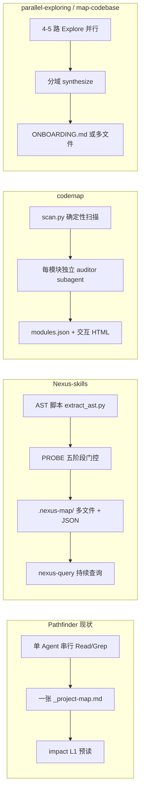

# Pathfinder Skill 调研与会话记录

> **会话日期**：2026-06-17  
> **项目**：`blue-skillhub` / `skills/pathfinder`  
> **参与者**：用户 + Cursor Agent（Auto）  
> **文档性质**：本会话完整归档——含用户提问、Agent 探索过程、分析结论、竞品调研、v2 架构提案  
> **状态**：调研与设计讨论，尚未实施 v2

---

## 目录

1. [会话概览](#1-会话概览)
2. [第一轮：Pathfinder Skill 初读与分析](#2-第一轮pathfinder-skill-初读与分析)
3. [第二轮：全网竞品调研与差距分析](#3-第二轮全网竞品调研与差距分析)
4. [第三轮：一次性解决五大问题的 v2 架构提案](#4-第三轮一次性解决五大问题的-v2-架构提案)
5. [第四轮：本会话归档请求](#5-第四轮本会话归档请求)
6. [附录 A：Pathfinder 目录结构（会话时点）](#附录-apathfinder-目录结构会话时点)
7. [附录 B：工作区未提交改动（SVG 预览增强）](#附录-b工作区未提交改动svg-预览增强)
8. [附录 C：外部参考链接汇总](#附录-c外部参考链接汇总)

---

## 1. 会话概览

| 轮次 | 用户问题（原文要点） | Agent 主要动作 | 核心产出 |
|------|----------------------|----------------|----------|
| 1 | 「你看看这个 skill」（`skills/pathfinder`） | 读 SKILL.md、README、模板、handoff 契约；看 git diff | Pathfinder 定位、流程、优缺点、近期 SVG 改动 |
| 2 | 「检索类似高 star skill，我们的差距在哪」 | Web 搜索 + 抓取 Nexus/codemap/onboarding 等 SKILL.md | 六大结构性差距 + 改进 ROI 排序 |
| 3 | 「如何一次性解决这些问题」（列 5 条体感问题） | 基于差距设计统一架构 | Pathfinder v2 Facts-First Pipeline 完整方案 |
| 4 | 「把本会话所有内容输出 md 到项目中，必须完整」 | 撰写本文档 | 本文件 |

---

## 2. 第一轮：Pathfinder Skill 初读与分析

### 2.1 用户提问（原文）

> E:\agent\blue-skillhub\skills\pathfinder 你看看这个skill

### 2.2 Agent 探索过程

#### 2.2.1 读取的文件

| 路径 | 用途 |
|------|------|
| `skills/pathfinder/SKILL.md` | 核心规则、Phase 0–5、硬性规则、章节结构 |
| `skills/pathfinder/README.md` | 人类可读说明、测评基线、模型敏感性 |
| `skills/pathfinder/templates/project-map.md` | `_project-map.md` 14 节模板 |
| `skills/pathfinder/references/handoff-contract.md` | 与 impact/impact-pro 协作约定 |
| `skills/pathfinder/references/phase-2-breadth-scan.md` | Phase 2 广度扫描规则（部分） |
| `skills/pathfinder/validation-runs/INDEX.md` | 验证记录索引 |
| `git diff skills/pathfinder/` | 工作区未提交改动 |

#### 2.2.2 目录清单（Glob 结果，共 14 个文件）

```
skills/pathfinder/
├── SKILL.md
├── README.md
├── code-graph-adapters/generic-mcp.md
├── references/
│   ├── phase-1-sizing.md
│   ├── phase-2-breadth-scan.md
│   ├── phase-3-depth-fill.md
│   ├── stack-detection.md
│   ├── handoff-contract.md
│   └── cross-platform-notes.md
├── templates/project-map.md
└── validation-runs/
    ├── INDEX.md
    ├── 2026-06-13-T01-first-real-run.md
    ├── 2026-06-13-T02-mermaid-p1p2-fix.md
    └── 2026-06-13-T03-v3-handoff-verified.md
```

### 2.3 Agent 分析结论（第一轮完整摘要）

#### 2.3.1 一句话定位

**只读摸底陌生项目，产出 `change-impact/_project-map.md`，回答「这项目是什么样的」，不做变更影响分析，也不给改造建议。**

#### 2.3.2 工具箱分工

| 角色 | Skill | 职责 |
|------|-------|------|
| 脑子 | RuleBlade | 少猜、说人话 |
| **眼睛** | **Pathfinder** | **看懂陌生项目** |
| 手 | impact / impact-pro | 不乱动、按步骤、必确认 |

Pathfinder 是 impact 的**可选加速器**，不是前置必跑项。

#### 2.3.3 执行流程（Phase 0 → 5）

```
Phase 0  触发 + 聚焦问题（用户关注什么 → 决定深挖顺序，不裁剪广度）
Phase 1  体量测量 + 预算分档（小/中/大仓，Git 归属检查）
Phase 2  广度优先扫描（栈探测、目录树、入口、模块边界）
Phase 3  聚焦深挖（填 14 个核心节 + 三张图）
Phase 4  产出地图 → change-impact/_project-map.md
Phase 5  扩展循环（用户说「再挖 X」→ 增量更新）
```

#### 2.3.4 核心原则（硬性）

- **100% 只读** — 唯一可写文件是 `_project-map.md`（位于目标项目根 `change-impact/` 内）
- **只描述，不开药方** — 风险只记录，不给改法
- **每条结论带可信度** — `【已核实: 证据】` / `【推断: 待验证】`
- **未覆盖项必须显式列出** — 沉默比漏看更危险
- **Git 归属纪律** — 非独立 Git 仓库不得用父仓库 HEAD 冒充本项目 commit

#### 2.3.5 产出物：14 核心节 + 3 可选节

| 节 | 内容 | 对 impact 的价值 |
|----|------|------------------|
| 【3】架构/模块图 | Mermaid + 可选 SVG | **L1 导航** |
| 【6】数据模型 | ER 图 | L2 起点 |
| 【8】构建·运行·测试 | 命令记录 | **L1 导航** |
| 【11】典型主流程 | 只 trace 一条请求 | 读懂项目杠杆最高 |
| 【13】未覆盖项 | 诚实声明 | 防误判「已全懂」 |

三张图统一信任纪律：**实线 = 已核实，虚线 = 推断**。

#### 2.3.6 与 impact 的协作（拉取式，零硬依赖）

```
Pathfinder ──写──> change-impact/_project-map.md
                          │
                          ▼ (impact Phase 2 主动读，读不到就照旧)
impact / impact-pro ── L1 预读 ──> 自己做 L2/L3 切片深挖
```

- `【已核实】` → 当导航线索
- `【推断】` → 进「未确认项」，动手前重新取证
- HEAD 不一致 → 标「地图可能过期」

契约见 `references/handoff-contract.md`。

#### 2.3.7 测评与质量

- **9 维 rubric**（L0 静态 / L1 行为契约 / L2 人审）
- **基线**（`eval/baselines/pathfinder.json`）：2026-06-13 L1，平均基础分 94.0/100，0 P0
- **模型敏感性**（README 明示）：
  - Opus 4.8：RuoYi-Vue 实测 ~99.5/100
  - 弱模型：可掉到 ~61/100（行号造假、凭证明文、推断画实线等）
- **触发方式**：`disable-model-invocation: true`，需手动 `/pathfinder`
- **验证记录**：T03 V3 端到端 pathfinder→impact 实跑 PASS（5/5 契约，handoff_value=high）

#### 2.3.8 第一轮总体评价

**优点：**

- 边界清晰（vs impact、vs 从 0 搭系统）
- 可信度体系完整（文字 + 图 + Phase 4.5 自检）
- 自适应分档（大仓不硬扫）
- 有 eval 基线和 handoff 实跑验证
- 渐进式披露（SKILL 浓缩 + references 按需加载）

**值得注意：**

- 弱模型下仍需人工复核凭证脱敏和 `【已核实】` 行号
- SVG 会增加 token 消耗（规则限制 5–9 节点且可选）
- `allowed-tools` 含 DB MCP，但只读约束靠规则而非工具白名单

#### 2.3.9 会话时点工作区改动：内联 SVG 预览增强

见 [附录 B](#附录-b工作区未提交改动svg-预览增强)。

---

## 3. 第二轮：全网竞品调研与差距分析

### 3.1 用户提问（原文）

> 我总感觉 pathfinder 目前跑出来的结果差点意思 你帮我全网检索一下类似的高star kill是如何设计的 我们的差距在哪里

（注：用户笔误「kill」应为「skill」。）

### 3.2 Agent 探索过程

#### 3.2.1 检索策略

并行 Web 搜索关键词：

- `GitHub high star AI agent skill codebase exploration project map 2025 2026`
- `Cursor agent skill SKILL.md repository onboarding codebase understanding`
- `Claude Code skills explore codebase architecture map anthropic`
- `GitHub awesome agent skills code navigation context pack`
- `addyosmani agent-skills context-engineering codebase onboarding`

#### 3.2.2 抓取/阅读的竞品材料

| 来源 | 方式 | 结果 |
|------|------|------|
| [Nexus-skills](https://github.com/Haaaiawd/Nexus-skills) README.zh-CN | WebFetch | PROBE 协议、`.nexus-map/` 结构、query_graph.py |
| [Nexus-skills nexus-mapper/SKILL.md](https://github.com/Haaaiawd/Nexus-skills) | WebFetch raw | 完整 SKILL 正文 |
| [codemap-skill/SKILL.md](https://github.com/Asixa/codemap-skill) | WebFetch raw | modules.json + HTML + 独立 subagent 审计 |
| [awesome-cursor-skills/codebase-onboarding](https://github.com/spencerpauly/awesome-cursor-skills) | WebFetch raw | 5 路并行 explore |
| [codebase-knowledge-builder/SKILL.md](https://github.com/OthmanAdi/codebase-knowledge-builder) | WebFetch raw | 四阶段 lean workflow |
| Claude Code Subagents 文档 | WebFetch / 搜索 | Explore/Plan 内置 subagent |
| map-codebase（philoserf） | agent-skills.md 索引 | 4 路并行 → `.planning/codebase/` |
| [Cartographer](https://github.com/miltonian/cartographer) | 搜索摘要 | 浏览器 UI world model |
| Agent Skills 规范 / MindStudio 四层架构 | 搜索 | progressive disclosure 最佳实践 |

#### 3.2.3 重要发现：该领域高 star 项目很少

**Nexus-skills（~158★）已是头部**。多数设计成熟的方案 star 不高，但执行模式值得借鉴。

### 3.3 对标样本表

| 项目 | Stars（约） | 定位 | 核心手段 |
|------|------------:|------|----------|
| [Nexus-skills](https://github.com/Haaaiawd/Nexus-skills) | ~158 | 持久化代码库知识图谱 | Tree-sitter AST + PROBE 五阶段 + `query_graph.py` |
| [codemap-skill](https://github.com/Asixa/codemap-skill) | 低但设计完整 | 架构图 + 模块健康分 | 确定性 Python 脚本 + 每模块独立 subagent 审计 |
| [codebase-onboarding](https://github.com/spencerpauly/awesome-cursor-skills) | 合集内 | 快速 onboarding 文档 | **5 路并行 explore subagent** |
| [codebase-knowledge-builder](https://github.com/OthmanAdi/codebase-knowledge-builder) | 低 | 子系统深度知识包 | 轻量 workflow + 每 topic 独立 artifact |
| map-codebase（philoserf） | 社区 skill | 多文件结构化文档 | **4 路并行 Explore** |
| [Cartographer](https://github.com/miltonian/cartographer) | 早期 | 可浏览 world model | 持久模型 + 浏览器 UI + MCP |

### 3.4 架构对比图（Agent 绘制）



**Pathfinder 独特价值**：只读安全、可信度标签、impact handoff、未覆盖项诚实。

**头部方案共同点**：把「发现」尽量从 LLM 幻觉里**剥离到脚本/并行 agent**，让模型只做「解读和写作」。

### 3.5 六大结构性差距（按体感影响排序）

#### 差距 1：执行模型 — 单线程 vs 并行专探

| | Pathfinder | 竞品 |
|--|------------|------|
| 模式 | Phase 2–3 单 agent 串行 Glob/Grep/Read | 4–5 路 explore 并行 |
| 后果 | 14 节抢上下文，易「广而不深」或「深而不全」 | 通常 <1 分钟且每域更深 |
| 证据 | `phase-2-breadth-scan.md` 未强制 Task/explore 并行 | codebase-onboarding 核心就三步：Launch → Synthesize → Save |

#### 差距 2：无确定性工具层 — 全靠模型「读对」

| | Pathfinder | Nexus / codemap |
|--|------------|-----------------|
| 事实来源 | 100% Read/Grep；code graph MCP 可选未内置 | `extract_ast.py`、`scan.py`、`query_graph.py` |
| 后果 | 弱模型 61 vs Opus 99.5 | 脚本层降低方差 |

#### 差距 3：产出形态 — 单文件百科全书 vs 可路由知识库

| | Pathfinder | Nexus |
|--|------------|-------|
| 产出 | 单一 `_project-map.md` 数千 token | `INDEX.md`（<2000 tokens）+ 分片 + `concept_model.json` |
| 后果 | 难扫、难增量 | 冷启动快、按需加载 |

Pathfinder Phase 5「再挖 X」可增量，但**无模块级 hash / staleness 检测**（codemap 有 `check`/`update`）。

#### 差距 4：缺少 onboarding 产品化层

**codebase-onboarding** 强调：

- Quick Start（5 步可跑）
- Key Files to Know（每个一句 why）
- Gotchas

**Pathfinder** 偏审计报告体，【4】核心功能多为【推断】——对新人「这项目到底干什么」不够直给。

**这是用户「差点意思」最可能的主观来源。**

#### 差距 5：无持续查询能力 — 一次性地图 vs 活的知识库

| 能力 | Pathfinder | Nexus |
|------|------------|-------|
| 改接口前查影响面 | 无（交给 impact） | `--who-imports` |
| 找耦合热点 | 【9】文字 | `--hub-analysis` + git forensics |
| 地图过期 | 比 HEAD | 模块 content hash + commits since last run |
| 机器可读图谱 | 无 | `concept_model.json` |

#### 差距 6：缺少「质疑初始假设」的正式环节

Nexus **OBJECT 阶段**要求用 git stats 挑战 REASON 假说，禁止空泛质疑。

Pathfinder Phase 2→3 **线性推进**，弱模型易把目录名当架构。

### 3.6 差距矩阵（一句话版）

| 维度 | Pathfinder | Nexus | codemap | parallel-onboarding |
|------|:----------:|:-----:|:-------:|:-------------------:|
| 并行探索 | ❌ | 部分 | ✅ | ✅✅ |
| 确定性脚本 | ❌ | ✅✅ | ✅✅ | ❌ |
| 多文件/可路由产出 | ❌ | ✅✅ | ✅ | ✅ |
| 交互可视化 | △ SVG | Mermaid | ✅ HTML | ❌ |
| Quick Start 体感 | △ | △ | ❌ | ✅✅ |
| 增量更新/staleness | △ HEAD | ✅ | ✅✅ | ❌ |
| 结构查询 API | ❌ | ✅✅ | ✅ | ❌ |
| 可信度/安全 | ✅✅ | ✅ | ✅ | ❌ |
| impact 集成 | ✅✅ | ❌ | ❌ | ❌ |

### 3.7 Pathfinder 仍领先之处（不应丢弃）

| 维度 | Pathfinder | 多数竞品 |
|------|------------|----------|
| 可信度标签 | 【已核实】/【推断】全文 + 图 | 部分有 provenance |
| 只读安全 | 硬性规则 + eval 9 维 | 部分会跑 build/test |
| impact 协作 | handoff-contract + L1 接口 | 各自为政 |
| 未覆盖项诚实 | 【13】强制 | 常伪装全覆盖 |
| 测评体系 | L0/L1/L2 + baseline | 多数无 |
| 大仓分档 | 小/中/大/超大 + 预算 | 部分有 |

**结论**：Pathfinder 在「给 impact 用的可信 L1 契约」上是优等生；在「让人/Agent 快速建立可行动认知」上，缺执行引擎和 onboarding 产品化。

### 3.8 第二轮改进建议（按 ROI，实施 v2 前）

| 优先级 | 建议 |
|--------|------|
| P0 | Phase 2 强制 5 路并行 subagent |
| P0 | 增加 Quick Start / Key Files / Gotchas（或 Executive Summary） |
| P0 | `_project-map.md` 顶部 ≤500 token 导航摘要 |
| P1 | 轻量 `scripts/`（scan + git_summary，stdlib-only） |
| P1 | Phase 2.5 假说挑战（借鉴 Nexus OBJECT） |
| P2 | 拆分产出 + pathfinder-query companion |
| P2 | 交互 HTML（render from JSON） |

---

## 4. 第三轮：一次性解决五大问题的 v2 架构提案

### 4.1 用户提问（原文）

> 如何一次性解决这些问题？
>
> - 「信息有了但不好用」—— 单文件百科全书体，缺 Quick Start / Key Files / Gotchas
> - 「深度不够 / 有点泛」—— 单 agent 串行，没强制并行专探
> - 「有时不靠谱」—— 无 AST/git 脚本层，弱模型方差大（61 vs 99.5）
> - 「跑一次就完了」—— 无 query/staleness，不如 Nexus/codemap 「活」
> - 「图有了但不够直观」—— Mermaid/SVG 是静态；竞品有 HTML/浏览器 UI

### 4.2 Agent 核心论点

五个问题根因相同：**Pathfinder 现在是「LLM 直接写 Markdown」**；竞品是 **「事实层 → 并行解读 → 结构化存储 → 多形态渲染 → 持续查询」**。

**一次性解决 = 换成 Facts-First Pipeline，不是打五个补丁。**

### 4.3 统一原则：一个真相源，四种消费面

```
scripts 产出 facts（确定性）
        ↓
parallel agents 产出 domain reports（深度）
        ↓
synthesize → map.json（唯一真相源，schema 校验）
        ↓
render → index.md + shards + _project-map.md + map.html
        ↓
live  → check / query / update（增量）
```

**关键不变量：**

- 模型**不再手写** `_project-map.md`；只填/改 `map.json`
- Markdown / HTML 全是 **render 产物**
- impact 继续读 `_project-map.md`（自动生成 rollup，**零 breaking change**）

### 4.4 新产出结构

```
change-impact/
├── _project-map.md              ← 自动生成（impact L1 兼容层，rollup）
└── _project-map/                ← v2 真相目录
    ├── index.md                 ← 第一屏：<800 tokens，给人看
    ├── onboarding.md            ← Quick Start + Key Files + Gotchas
    ├── stack.md                 ← 【2】技术栈
    ├── architecture.md          ← 【3】架构 + Mermaid
    ├── data.md                  ← 【6】数据模型
    ├── flows.md                 ← 【11】主流程
    ├── risks.md                 ← 【9】风险
    ├── ...                      ← 其余节按需 shard
    ├── map.json                 ← 机器真相源（query/check/update 读它）
    ├── map.html                 ← 自包含交互图（浏览器打开）
    ├── facts/                   ← 脚本原始输出（只读缓存）
    │   ├── scan.json
    │   ├── git.json
    │   └── imports.json
    └── reports/                 ← 并行 agent 原始报告（审计用）
        ├── arch.json
        ├── data.json
        ├── api.json
        ├── auth.json
        └── ops.json
```

#### 五问题 → v2 解法对照

| 用户问题 | v2 解法 |
|----------|---------|
| 信息有了但不好用 | `index.md` + `onboarding.md` 强制 Quick Start / Key Files / Gotchas |
| 深度不够 | Phase 2 **固定 5 路并行** explore → `reports/*.json` |
| 有时不靠谱 | `facts/*.json` 脚本生成；`pf_validate.py` 拒收假行号/明文凭证 |
| 跑一次就完了 | `map.json.meta` 存 commit + 模块 hash；`pf check` / `pf query` / `pf update` |
| 图不直观 | `map.html` 从同一 `map.json` 渲染，可交互、verified/inferred 视觉区分 |

### 4.5 新流程（替换 Phase 1–5）

```
Phase 0   聚焦问题（不变）
Phase 1   体量 + Git 归属（不变，数字改由脚本出）
Phase 1.5 FACTS 层 ← 新增
Phase 2   PARALLEL 层 ← 重写（5 路并行）
Phase 2.5 CHALLENGE 层 ← 新增（Nexus OBJECT 借鉴）
Phase 3   SYNTHESIS → map.json
Phase 4   RENDER → md/html
Phase 5   LIVE：check / query / update
```

### 4.6 Phase 1.5 — FACTS 层（stdlib only）

| 脚本 | 产出 | 作用 |
|------|------|------|
| `pf_scan.py` | `facts/scan.json` | 文件数、扩展名、manifest、目录树 |
| `pf_git.py` | `facts/git.json` | toplevel/HEAD、hotspots、近期 commit 模块 |
| `pf_imports.py` | `facts/imports.json` | 轻量 import/require 索引（grep 级） |
| `pf_validate.py` | exit code + 错误 | schema、file:line、凭证脱敏 |

**硬规则**：标【已核实: file:行号】必须来自 `facts/` 或 Read/Grep；validate 不通过禁止 render。

AST（Tree-sitter）可作为 **v2.1 可选 `--deep`**，v2.0 坚持 stdlib-only。

### 4.7 Phase 2 — 强制 5 路并行

单消息 spawn 5 个 `explore` subagent：

| Agent | 职责 | 输出 |
|-------|------|------|
| A1 架构 | 模块边界、分层、依赖 | `reports/arch.json` |
| A2 数据 | schema/model/migration | `reports/data.json` |
| A3 入口/API | 路由、CLI、MQ、定时任务 | `reports/api.json` |
| A4 权限 | authn/authz、中间件 | `reports/auth.json` |
| A5 运维 | 构建/运行/测试/部署/CI | `reports/ops.json` |

Report 使用**固定 JSON schema**（含 `hypotheses_challenged` 字段），示例：

```json
{
  "domain": "architecture",
  "modules": [
    {
      "id": "src/api",
      "label": "HTTP 接口层",
      "relevance": 3,
      "confidence": "verified",
      "evidence": ["src/routes/index.ts:12"],
      "depends_on": ["src/services"]
    }
  ],
  "hypotheses_challenged": [
    {
      "claim": "入口在 src/main.ts",
      "counter_evidence": "git.json hotspots[0].path=src/server/bootstrap.ts",
      "resolution": "verified"
    }
  ]
}
```

### 4.8 Phase 2.5 — CHALLENGE

主 agent 必须产出 ≥2 条「目录名假说 vs facts 矛盾」，写入 `map.json.meta.challenges[]`。

### 4.9 Phase 3 — SYNTHESIS

1. merge `facts/` + `reports/` → `map.json`
2. `python pf_validate.py map.json facts/`
3. 通过后进入 Phase 4

### 4.10 Phase 4 — RENDER

| 命令 | 产出 |
|------|------|
| `pf_render_md.py map.json` | `index.md` + shards + `_project-map.md` rollup |
| `pf_render_html.py map.json` | `map.html` |

**`index.md` 固定结构：**

- 30 秒读懂 / 一句话
- Quick Start（5 步）
- 从这 5 个文件开始（表格）
- Top 3 风险
- 导航链接（onboarding / architecture / map.html）

### 4.11 Phase 5 — LIVE 层

| 命令 | 行为 |
|------|------|
| `/pathfinder check` | 比 HEAD + 模块 hash；输出 stale + 近期 commits |
| `/pathfinder query --module src/api` | 依赖/被依赖 |
| `/pathfinder query --who-imports X` | 反向依赖 |
| `/pathfinder update` | 只重跑 stale 模块 + 增量 merge + re-render |

**`map.json.meta` 示例：**

```json
{
  "generated_at": "2026-06-17T...",
  "git": { "head": "abc1234", "toplevel": "/path/to/repo", "independent": true },
  "module_hashes": { "src/api": "sha256:...", "src/services": "sha256:..." },
  "budget_tier": "medium",
  "focus": "权限模块"
}
```

### 4.12 `map.json` 最小 schema

```json
{
  "meta": { "...": "..." },
  "onboarding": {
    "one_liner": "",
    "quick_start": ["clone", "install", "env", "migrate", "run"],
    "key_files": [
      { "path": "", "why": "", "confidence": "verified|inferred", "evidence": [] }
    ],
    "gotchas": [
      { "text": "", "confidence": "verified|inferred", "evidence": [] }
    ]
  },
  "sections": {
    "stack": { "items": [], "confidence": "..." },
    "architecture": { "modules": [], "mermaid": "..." },
    "data": { "entities": [], "mermaid": "..." },
    "entries": { "items": [] },
    "auth": {},
    "build_run_test": { "commands": [] },
    "risks": { "items": [] },
    "flows": { "trace": [], "mermaid": "..." },
    "docs": { "items": [] },
    "coverage": { "deep": [], "shallow": [] }
  },
  "graphs": {
    "architecture": { "nodes": [], "edges": [] },
    "er": { "nodes": [], "edges": [] },
    "flow": { "nodes": [], "edges": [] }
  }
}
```

每条 edge/node 带 `confidence` + `evidence[]`。

### 4.13 impact 兼容策略

impact Phase 2 读取顺序（建议更新 `handoff-contract.md`）：

1. `change-impact/_project-map/index.md`（若存在，优先，≤800 tokens）
2. `change-impact/_project-map.md`（rollup，v1/v2 通用）
3. `change-impact/_project-map/map.json`（可选，机器消费）

章节【0】–【13】编号在 rollup 中保持不变 → **impact 零改动也能用**。

### 4.14 与 Nexus / codemap 定位差（避免重复造轮子）

| | Nexus | codemap | Pathfinder v2 |
|--|-------|---------|---------------|
| AST | Tree-sitter 完整 | 无 | v2.0 grep；v2.1 可选 AST |
| 主目标 | 知识库 + query | 架构图 + 健康分 + fix | **impact L1 + onboarding** |
| 产出目录 | `.nexus-map/` | `.codemap/` | `change-impact/_project-map/` |
| 改代码 | 否 | fix 会改 | **100% 只读** |

### 4.15 实施里程碑（一个 v2 PR 系列）

| 步骤 | 交付物 | 估时 |
|------|--------|------|
| M1 骨架 | `scripts/` 5 个 + `schemas/map.v2.json` + `templates/index.md` | 1–2 天 |
| M2 流程 | 重写 phase-2 + 新 phase-1.5-facts + phase-4-render | 1 天 |
| M2.5 HTML | `assets/map.template.html` + `pf_render_html.py` | 1 天 |
| M3 LIVE | check/query/update + SKILL Phase 5 | 1 天 |
| M4 测评 | 更新 eval cases + go-admin/ruoyi 对比 v1 | 0.5 天 |

**验收标准：**

1. 新人打开 `index.md` 2 分钟内能跑起来
2. 5 路 report 均 merge 进 map.json
3. 弱模型 validate 通过率 ≥90%
4. `pathfinder check` 识别 HEAD/hash 漂移
5. `map.html` 可交互，verified/inferred 可区分
6. impact 读 rollup 与 v1 行为一致

### 4.16 待用户决策的两点

1. **产出目录**：推荐 `_project-map/` + 自动生成 `_project-map.md` rollup
2. **v2.0 stdlib-only**：是 → grep imports；否 → v2.1 可选 tree-sitter

---

## 5. 第四轮：本会话归档请求

### 5.1 用户提问（原文）

> 你先帮我和你在本会话中交流的所有内容输出md到项目中 包括我提的问题 你的探索 你分析结果等等 要求必须完整

### 5.2 Agent 动作

撰写本文件：`docs/archive/2026-06/2026-06-17-pathfinder-session-research-and-v2-proposal.md`

---

## 附录 A：Pathfinder 目录结构（会话时点）

```
pathfinder/
├── SKILL.md                      # 核心规则(硬性规则子集 + Phase 概览 + 章节结构 + 索引)
├── README.md                     # 用户入口、测评基线、模型敏感性
├── references/
│   ├── phase-1-sizing.md
│   ├── phase-2-breadth-scan.md
│   ├── phase-3-depth-fill.md
│   ├── stack-detection.md
│   ├── handoff-contract.md
│   └── cross-platform-notes.md
├── code-graph-adapters/
│   └── generic-mcp.md
├── templates/
│   └── project-map.md
└── validation-runs/
    ├── INDEX.md
    ├── 2026-06-13-T01-first-real-run.md
    ├── 2026-06-13-T02-mermaid-p1p2-fix.md
    └── 2026-06-13-T03-v3-handoff-verified.md
```

**设计文档（历史）**：`docs/archive/2026-06/2026-06-13-pathfinder-skill-design.md`

**eval 基线**：`eval/baselines/pathfinder.json`

---

## 附录 B：工作区未提交改动（SVG 预览增强）

会话开始时 `git diff skills/pathfinder/` 显示以下未提交改动（2026-06-17 工作区状态）：

### B.1 改动文件

- `skills/pathfinder/SKILL.md`
- `skills/pathfinder/references/phase-3-depth-fill.md`
- `skills/pathfinder/templates/project-map.md`

### B.2 改动要点

1. **SKILL.md**
   - 新增「SVG 预览说明」：Mermaid 为 canonical source；SVG 内联于 `_project-map.md`；禁止外链/旁路 `.svg` 文件
   - Phase 3：Mermaid + 可选内联 SVG
   - Phase 4.5 自检：4 项 → **5 项**（新增 SVG 安全）

2. **phase-3-depth-fill.md**
   - 「Mermaid 图绘制规则」→「图形输出规则」
   - 新增完整 **SVG 预览图绘制规则**（8 条：同源、同义、安全元素、不写额外文件、控复杂度、ID 前缀 `pf-arch-*`/`pf-er-*`/`pf-flow-*`、凭证安全、兼容降级）
   - Phase 4.5 第 4、5 项扩展 Mermaid/SVG 一致性

3. **templates/project-map.md**
   - 【3】【6】【11】各增加 SVG 示例模板（与 Mermaid 示例同构）
   - ER 图 Mermaid 示例增加 `ORDER -.推断.-> PAYMENT`

### B.3 关联临时验证目录（git status 未跟踪）

```
.tmp/pathfinder-svg-preview/
├── README.md
├── preview.html
├── preview.png
├── config/settings.yml
├── src/...
└── change-impact/_project-map.md
```

---

## 附录 C：外部参考链接汇总

| 链接 | 说明 |
|------|------|
| https://github.com/Haaaiawd/Nexus-skills | Nexus-skills（~158★），nexus-mapper + nexus-query |
| https://github.com/Asixa/codemap-skill | codemap，modules.json + HTML + 健康分 |
| https://github.com/spencerpauly/awesome-cursor-skills | codebase-onboarding / parallel-exploring |
| https://github.com/OthmanAdi/codebase-knowledge-builder | codebase-knowledge-builder |
| https://github.com/miltonian/cartographer | Cartographer，浏览器 UI world model |
| https://code.claude.com/docs/en/sub-agents | Claude Code 内置 Explore/Plan subagent |
| https://github.com/agentskills/agentskills | Agent Skills 开放规范 |
| https://www.mindstudio.ai/blog/claude-code-skills-architecture-progressive-context-loading | Skills 四层渐进式加载 |
| https://agents.siddhantkhare.com/13-agents-md-onboarding/ | AGENTS.md 与 onboarding |
| https://blog.logrocket.com/context-engineering-for-ides-agents-md-agent-skills/ | Context engineering 实测 |
| https://serenitiesai.com/articles/agent-skills-guide-2026 | Agent Skills 2026 指南 |

---

## 附录 D：会话中引用的项目内路径

| 路径 | 说明 |
|------|------|
| `skills/pathfinder/SKILL.md` | Pathfinder 主 skill |
| `skills/pathfinder/README.md` | 说明与测评 |
| `skills/pathfinder/templates/project-map.md` | 地图模板 |
| `skills/pathfinder/references/handoff-contract.md` | impact 交接契约 |
| `skills/pathfinder/references/phase-2-breadth-scan.md` | Phase 2 规则 |
| `skills/pathfinder/references/phase-3-depth-fill.md` | Phase 3 + SVG 规则 |
| `skills/pathfinder/validation-runs/INDEX.md` | 验证索引 |
| `eval/baselines/pathfinder.json` | L1 基线分数 |
| `docs/archive/2026-06/2026-06-13-pathfinder-skill-design.md` | 原始设计文档 |

---

*文档结束。若实施 Pathfinder v2，建议在本文件同级追加 `2026-06-XX-pathfinder-v2-implementation-plan.md` 或在 `skills/pathfinder/` 下新增 `design/v2/` 目录跟踪实现进度。*
