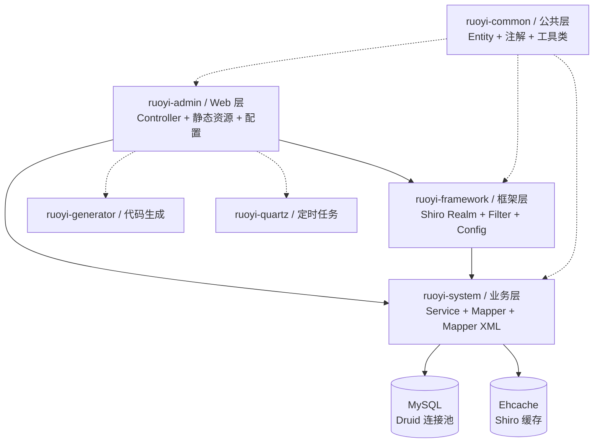
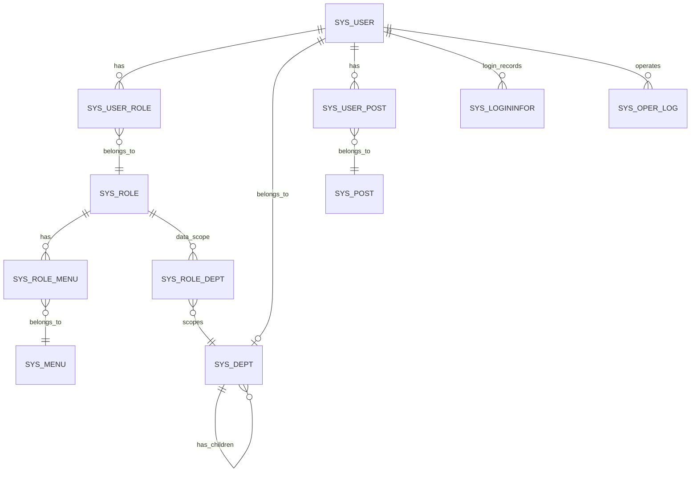

# RuoYi (若依管理系统) 项目结构总览

> 本地图由 Pathfinder(领航)生成,供 impact 当 L1 导航上下文。
> 地图只是**导航参考，不是权威依据**:`【推断】`项动手前必须重新取证。

## 概览摘要（30 秒读懂）

**一句话**：RuoYi 是一个基于 Spring Boot + Shiro + MyBatis + Thymeleaf 的 Java 后台管理系统，提供用户、角色、菜单、部门等基础管理功能，以及代码生成、定时任务、操作日志等配套工具。面向企业内部管理系统场景。
证据：【已核实: pom.xml + ruoyi-admin/Controller + sql/ 目录】

**Quick Start（5 步跑起来）**：
1. **构建**: `mvn clean package -DskipTests`
2. **创建数据库**: MySQL 创建库 `ry`，执行 `sql/ry_20260319.sql` 和 `sql/quartz.sql`
3. **配置数据库**: 修改 `ruoyi-admin/src/main/resources/application-druid.yml` 中 `spring.datasource.druid.master` 的用户名和密码
4. **启动**: `java -jar ruoyi-admin/target/ruoyi-admin.jar` （或 `ry.bat start` / `ry.sh start`）
5. **访问**: http://localhost:80/login （默认管理员 admin / 密码可重置）

证据：【已核实: pom.xml、ry.sh、ry.bat、application.yml (port: 80)】

**从这 5 个文件开始读**：

| 文件 | 为什么重要 | 可信度 |
|------|-----------|--------|
| `ruoyi-admin/src/main/java/com/ruoyi/web/controller/system/SysUserController.java` | 用户 CRUD + 导出/导入接口，可看 Shiro 权限注解用法 | 【已核实: 文件内容】 |
| `ruoyi-common/src/main/java/com/ruoyi/common/core/domain/entity/SysUser.java` | 用户实体定义，含 @Excel 导出注解 | 【已核实: 文件内容】 |
| `ruoyi-framework/src/main/java/com/ruoyi/framework/shiro/realm/UserRealm.java` | 认证 + 授权核心逻辑 | 【已核实: 文件内容】 |
| `ruoyi-common/src/main/java/com/ruoyi/common/core/domain/BaseEntity.java` | 所有实体基类（含 remark、createBy、createTime 等公共字段） | 【已核实: 文件内容】 |
| `sql/ry_20260319.sql` | 完整 DDL + 初始化数据（用户/角色/菜单/权限） | 【已核实: 文件内容】 |

**Top 3 风险**：
1. 默认弱密码（数据库 root/password、Druid 控制台 ruoyi/123456）— 【已核实: application-druid.yml】
2. CSRF 默认关闭（csrf.enabled: false）— 【已核实: application.yml】
3. 演示模式开启（demoEnabled: true），admin 角色拥有 `*:*:*` 所有权限— 【已核实: application.yml + UserRealm.java】

**Top 3 Gotchas**：
1. `remark` 字段在 `BaseEntity` 中定义，所有继承 BaseEntity 的实体（SysUser、SysRole、SysMenu、SysDept、SysPost 等）都含该字段——改 User 的 remark 不等于只改 sys_user 表
2. 用户-角色是 N-1 关系（一个用户可多个角色，但查询时只取第一个角色的 data_scope 做数据权限过滤）
3. 导出使用 Apache POI 4.1.2 + 字段上 `@Excel` 注解自动映射，修改用户字段需要同步更新 `@Excel` 注解和 ExcelUtil 的映射

**导航**：→ 【3】架构分层 / 【6】数据模型 / 【8】构建运行 / 【11】主流程 / 【13】未覆盖项

---

## 【0】基本信息(可信度标记)

```
生成时间: 2026-07-04 15:30 (Get-Date)
基于 commit: 0d42679b (HEAD, 独立 Git 仓库)
预算档位: 中仓(693 源文件,285 Java,148 HTML,90 JS)
关注重点: 用户、角色、菜单、权限、导出、运行/测试命令，以及后续改用户模块最容易踩坑的地方
覆盖范围:
  已深入: 用户(user)、角色(role)、菜单(menu)、权限(Shiro authn/authz)、导出(ExcelUtil+@Excel)、运行/测试命令、SQL 数据模型
  未深入: 代码生成(ruoyi-generator)、定时任务(ruoyi-quartz)、前端 JS 交互细节、部署/Docker 配置、CI/CD → 见【13】
结构索引辅助:
  status: unused
  tool: none
  coverage: unknown
```

## 【1】一句话概述

- RuoYi (若依管理系统) v4.8.3 是一个基于 Spring Boot 4.0.6 + Apache Shiro 2.2.0 + MyBatis 4.0.1 + Thymeleaf 的企业级后台快速开发框架，提供用户/角色/菜单/部门/岗位等基础管理功能，配套代码生成器、定时任务、操作/登录日志、在线用户监控等功能。
- 证据：【已核实: pom.xml 依赖声明 + Controller 目录结构 + sql/ 目录 schema】

## 【2】技术栈

| 维度 | 内容 | 可信度 |
|------|------|--------|
| 语言 | Java 17 | 【已核实: pom.xml java.version】 |
| 主框架 | Spring Boot 4.0.6、Apache Shiro 2.2.0 | 【已核实: pom.xml】 |
| ORM | MyBatis 4.0.1 + PageHelper 分页 | 【已核实: pom.xml + application.yml】 |
| 视图 | Thymeleaf + shiro-thymeleaf 标签 | 【已核实: application.yml + user.html 模板】 |
| 构建工具 | Maven (pom.xml 多模块) | 【已核实: pom.xml 目录结构】 |
| 数据库 | MySQL (Druid 1.2.28 连接池) | 【已核实: application-druid.yml + sql/*.sql】 |
| 导出 | Apache POI 4.1.2 (通过 @Excel 注解 + ExcelUtil) | 【已核实: pom.xml + SysUser 实体 @Excel 注解】 |
| 缓存 | Ehcache (ehcache-shiro.xml) | 【已核实: ShiroConfig.java 引用】 |
| API 文档 | Springdoc 3.0.3 (Swagger UI) | 【已核实: application.yml springdoc 配置】 |
| 工具库 | Fastjson 1.2.83、commons-io 2.22.0、oshi 7.3.0 | 【已核实: pom.xml】 |

## 【3】架构分层 / 模块地图

| 模块 / 目录 | 推断职责 | 相关性 | 可信度 |
|-------------|----------|--------|--------|
| `ruoyi-admin/` | Web 层 (Controller、静态资源、配置、入口类) | 核心 | 【已核实: 目录结构】 |
| `ruoyi-common/` | 公共模块(实体、注解、工具类、常量、异常) | 核心 | 【已核实: 目录结构】 |
| `ruoyi-framework/` | 框架层 (Shiro 配置、Realm、Filter、Service) | 核心 | 【已核实: 目录结构】 |
| `ruoyi-system/` | 业务层 (Service、Mapper、Service 接口实现) | 核心 | 【已核实: 目录结构】 |
| `ruoyi-generator/` | 代码生成器 (GenController、GenTable、模板) | 工具 | 【已核实: 目录结构】 |
| `ruoyi-quartz/` | 定时任务 (Job Controller、Mapper、Service) | 工具 | 【已核实: 目录结构】 |
| `sql/` | DDL + 初始化数据 | 核心 | 【已核实: 目录结构】 |

**架构图**(只画有证据的边;实线 = 【已核实】依赖,虚线 = 【推断】依赖):

节点：WEB(ruoyi-admin)、FMW(ruoyi-framework)、SVC(ruoyi-system)、COMMON(ruoyi-common)、GEN(ruoyi-generator)、QZ(ruoyi-quartz)、DB(MySQL)、CACHE(Ehcache)。



> 模块间依赖方向：ruoyi-admin → ruoyi-framework → ruoyi-system → ruoyi-common。ruoyi-generator 和 ruoyi-quartz 是独立模块，被 ruoyi-admin 引用。

## 【4】核心功能

- **用户管理** — CRUD、按部门/角色授权、重置密码、导入/导出 Excel — 【已核实: SysUserController.java】
- **角色管理** — CRUD、角色-菜单授权（权限字符串分配）— 【已核实: SysRoleController.java】
- **菜单管理** — 树形菜单 CRUD、权限标识绑定 — 【已核实: SysMenuController.java】
- **部门管理** — 树形部门管理 — 【已核实: SysDeptController.java】
- **岗位管理** — 岗位 CRUD — 【已核实: SysPostController.java】
- **字典管理** — 字典类型/数据管理，Thymeleaf 中 `@dict.getType()` 动态渲染 — 【已核实: SysDictDataController.java】
- **参数配置** — 系统参数配置（如登录 IP 黑名单）— 【已核实: SysConfigController.java】
- **通知公告** — 公告发布 + 已读记录 — 【已核实: SysNoticeController.java + SysNoticeReadMapper】
- **操作日志** — 自动记录 `@Log` 标注的业务操作 — 【已核实: SysOperlogController.java】
- **登录日志** — 登录成功/失败记录 — 【已核实: SysLogininforController.java】
- **在线用户** — 查看和管理在线用户会话 — 【已核实: SysUserOnlineController.java】
- **定时任务** — Quartz 任务管理 — 【已核实: SysJobController.java】
- **代码生成** — 基于数据库表自动生成 CRUD 全套代码 — 【已核实: GenController.java】
- **系统监控** — Druid 数据源监控、服务监控、缓存监控 — 【已核实: CacheController/DruidController/ServerController】
- **表单构建** — 可视化表单构建 — 【已核实: BuildController.java】

## 【5】关键入口

| 类型 | 位置 | 可信度 |
|------|------|--------|
| 进程入口 | `ruoyi-admin/src/main/java/com/ruoyi/RuoYiApplication.java` | 【已核实: 文件存在】 |
| 登录认证 | `ruoyi-admin/.../controller/system/SysLoginController.java` | 【已核实: 文件内容】 |
| HTTP 路由定义 | Controller 类 `@RequestMapping` 注解 + ShiroConfig filterChain 全局 | 【已核实: 各 Controller】 |
| 全局过滤器链 | `ruoyi-framework/.../config/ShiroConfig.java` (shiroFilterFactoryBean) | 【已核实: 文件内容】 |
| 启动脚本 | `ry.sh` (Linux/Mac)、`ry.bat` (Windows) | 【已核实: 文件内容】 |

## 【6】数据模型概览

- 21 张业务表 + Quartz 11 张调度表
- 数据来源：【已核实: sql/ry_20260319.sql】

**主要实体关系**：



**核心表说明**：

| 表名 | 作用 | 关键字段 |
|------|------|---------|
| sys_user | 用户信息 | user_id, dept_id, login_name, password, salt, status, del_flag |
| sys_role | 角色定义 | role_id, role_name, role_key, data_scope, status |
| sys_menu | 菜单/权限 | menu_id, parent_id, menu_type(M/C/F), perms(权限标识) |
| sys_dept | 部门树 | dept_id, parent_id, ancestors, dept_name |
| sys_post | 岗位 | post_id, post_code, post_name |
| sys_user_role | 用户-角色关联 | user_id, role_id (N-1) |
| sys_role_menu | 角色-菜单关联 | role_id, menu_id (1-N) |
| sys_config | 系统参数配置 | config_key, config_value |
| sys_dict_data | 字典数据 | dict_value, dict_label, dict_type |

**关键约束**：
- `sys_user_role` 用户-角色 N-1（用户可持多个角色，但数据权限只取第一个有效角色的 data_scope）— 【推断: 从 DataScope AOP 逻辑推断，待验证】
- `sys_menu` 的 menu_type：M=目录、C=菜单、F=按钮，只有按钮级才有 perms 标识，目录/菜单通过父级关系控制可见性— 【已核实: sql 初始化数据 + SysMenu.java 注解】
- `status` 状态约定：`0`=正常、`1`=停用；`del_flag`：`0`=存在、`2`=删除— 【已核实: UserConstants.java + SQL DDL】
- `remark` 字段定义在 BaseEntity (ruoyi-common/.../core/domain/BaseEntity.java:39)，所有继承 BaseEntity 的实体均包含此字段 — 【已核实: BaseEntity.java】

## 【7】外部依赖与集成

| 依赖 | 用途 | 配置位置 | 可信度 |
|------|------|---------|--------|
| MySQL (ry) | 主数据库 | `ruoyi-admin/src/main/resources/application-druid.yml` | 【已核实: 文件内容】 |
| Ehcache | Shiro 缓存 | `ruoyi-admin/src/main/resources/ehcache/ehcache-shiro.xml` | 【已核实: 文件内容】 |
| Druid 监控 | SQL 监控/慢 SQL | `application-druid.yml` | 【已核实: 文件内容】 |

**关键配置键（密码已脱敏）**：

| 键 | 路径 | 备注 |
|----|------|------|
| `spring.datasource.druid.master.url` | application-druid.yml | JDBC 连接串 |
| `spring.datasource.druid.master.username` | application-druid.yml | DB 用户名: `root` |
| `spring.datasource.druid.master.password` | application-druid.yml | DB 密码: `***` — 默认弱密码 |
| `spring.datasource.druid.statViewServlet.login-username` | application-druid.yml | Druid 控制台用户: `ruoyi` |
| `spring.datasource.druid.statViewServlet.login-password` | application-druid.yml | Druid 控制台密码: `***` — 默认弱密码 |
| `ruoyi.profile` | application.yml | 上传文件路径: `D:/ruoyi/uploadPath` |
| `shiro.cookie.cipherKey` | application.yml | RememberMe 加密密钥 — 未配置时使用随机值 |

## 【8】构建·运行·测试

| 项 | 命令 / 现状 | 可信度 |
|----|-------------|--------|
| 构建 | `mvn clean package -DskipTests` （JDK 17 + Maven） | 【已核实: pom.xml + ry.sh】 |
| 运行(开发) | `java -jar ruoyi-admin/target/ruoyi-admin.jar` （服务端口 80） | 【已核实: application.yml + ry.sh】 |
| 运行(脚本) | `ry.sh start` / `ry.bat` 管理菜单 | 【已核实: ry.sh + ry.bat】 |
| 数据库 | 需先创建 MySQL 库 ry，执行 `sql/ry_20260319.sql` + `sql/quartz.sql` | 【已核实: SQL 文件内容】 |
| 测试 | **未发现测试目录或测试文件**（项目中无 test 目录） | 【已核实: 目录扫描无 */test/* Java 文件】 |
| Docker | 未发现 Dockerfile 或 docker-compose.yml | 【已核实: 未发现 docker 相关文件】 |

## 【9】风险区域

1. **默认弱密码（生产环境风险）** — `application-druid.yml` 中 DB 密码和 Druid 控制台密码均为默认值——【已核实: application-druid.yml:11 (DB password)、application-druid.yml:51 (Druid console password)】
2. **CSRF 防护关闭** — `csrf.enabled: false`，可能面临跨站请求伪造攻击——【已核实: application.yml:151】
3. **演示模式开启** — `demoEnabled: true`，可能影响业务操作的限制检查——【已核实: application.yml:10】
4. **管理员账户绕过全部权限校验** — Shiro UserRealm 中 admin 角色直接返回 `*:*:*`，绕过所有细粒度权限检查。这意味着 admin 看到的功能与非 admin 角色不同——这在设计上是预期的，但修改用户模块时如果以为所有角色都持相同的 permissions 集合会出错——【已核实: UserRealm.java:67-70】
5. **remark 字段跨实体共享** — `remark` 定义在 BaseEntity，SysUser、SysRole、SysMenu、SysDept、SysPost、SysNotice 等多个实体均继承该字段。修改用户模块时如果改了 BaseEntity 的 remark，会影响所有继承实体——【已核实: BaseEntity.java + 多个实体继承关系】
6. **无自动化测试** — 项目无任何测试目录/文件。修改用户模块后无法通过自动化测试回归——【已核实: 项目扫描无 test 目录】
7. **密码存储为 salt + MD5 散列** — `SysPasswordService` 使用 salt + 密码加密算法（MD5）。密码强度主要依赖客户端——【已核实: SysPasswordService.java + SysUserController addSave() 引用】
8. **XSS 防护排除通知公告** — XSS 过滤排除 `/system/notice/*`——【已核实: application.yml:144】
9. **Fastjson 1.2.83 版本较旧** — 该版本有已知漏洞——【已核实: pom.xml fastjson.version=1.2.83】

## 【10】权限 / 认证模型概览

- **认证(authentication)**：Apache Shiro UsernamePasswordToken + CaptchaValidateFilter(验证码) → UserRealm.doGetAuthenticationInfo() → SysLoginService.login() 校验用户存在、状态正常、密码匹配 → SimpleAuthenticationInfo(user, password, realmName)
  - 密码使用 salt + 加密存储，支持重试次数限制（5 次锁定 10 分钟）
  - 验证码支持数学计算/字符两种模式
  - 【已核实: SysLoginService.java + UserRealm.java】
- **授权(authorization)**：UserRealm.doGetAuthorizationInfo() → 加载用户角色 + 权限字符串 → SimpleAuthorizationInfo
  - admin 角色(role_id=1)直接返回 `*:*:*`（所有权限）
  - 非 admin 角色从 sys_role + sys_role_menu + sys_menu 联查获取 role set + permission set
  - 【已核实: UserRealm.java:57-80 + SysRole.java isAdmin()】
- **权限强制点**：
  - Controller 方法上的 `@RequiresPermissions("system:user:view")` 注解——Service 层走 Shiro 注解拦截
  - Thymeleaf 模板中的 `shiro:hasPermission="system:user:export"` 属性——前端按钮级隐藏
  - Shiro 全局过滤器链——所有 `/`, `/system/*`, `/monitor/*`, `/tool/*` 路径需认证
  - 【已核实: SysUserController.java + user.html + ShiroConfig.java shiroFilterFactoryBean】
- **数据权限**：通过 `@DataScope` 注解 + MyBatis SQL 拦截实现部门级数据隔离——【已核实: DataScope.java 注解定义】
- **权限字符串格式**：`system:module:action`，如 `system:user:view`、`system:user:list`、`system:user:export`——【已核实: sys_menu 初始化数据】

### 认证-鉴权字段一致性自检

**步骤 0 — 认证机制：JWT 类似模式（Shiro 自身）**

**步骤 1 — 认证链路**：UserRealm 从 `ShiroUtils.getSubject().getPrincipal()` 获取 `SysUser` 对象。认证成功后，`SysUser` 整个实体被设为 Shiro Principal。Session 中保存完整 `SysUser`。【已核实: ShiroUtils.java:33-41 + UserRealm.java:131】

**步骤 2 — 鉴权链路**：`@RequiresPermissions` 注解触发 UserRealm.doGetAuthorizationInfo()，从 subject principal 获取 `SysUser`，通过 `user.isAdmin()` 判断是否管理员（基于 userId），非管理员从数据库读取 roles + permissions。【已核实: UserRealm.java:58-79 + ShiroUtils.getSysUser()】

**步骤 3 — 比对**：授权获取的 userId 来自认证环节存入的 SysUser 实体——两者为同一对象，字段一致。授权不依赖单独的自定义 claims 或额外字段，一致性成立。

**步骤 4 — 结论**：认证-鉴权字段一致，无风险。【已核实】

## 【11】典型主流程（用户列表查询）

trace 用户登录后查看用户列表的完整请求：

节点：CTRL(SysUserController)、SVC(ISysUserService)、DSP(@DataScope 数据权限拦截)。


**逐跳文件证据**：

| 步骤 | 文件 / 方法 | 行号 | 可信度 |
|------|------------|------|--------|
| 登录认证 | `UserRealm.doGetAuthenticationInfo()` | :88-132 | 【已核实: 文件内容】 |
| 权限注解 | `SysUserController.user()` | :64-68 | 【已核实: 文件内容】 |
| 用户列表查询 | `SysUserController.list()` | :71-79 | 【已核实: 文件内容】 |
| 数据权限 | `@DataScope(deptAlias="d")` + SQL 拦截 | AOP 注入 | 【已核实: DataScope.java + 相关 Service 引用】 |
| Mapper SQL | `SysUserMapper.selectUserVo` (left join 三条) | :52-60 | 【已核实: SysUserMapper.xml】 |
| 分页 | `BaseController.startPage()` → PageHelper | ruoyi-common | 【已核实: BaseController.java】 |

## 【12】文档与知识入口

| 位置 | 类型 | 可信度(是否与代码同步) |
|------|------|------------------------|
| `README.md` | 项目介绍 + 功能截图 | 【已核实: 文件存在，项目概览描述】 |
| `doc/` 目录 | 文档 | 【推断: 存在但未深入查阅，待验证】 |
| `sql/ruoyi.pdm` | PowerDesigner 数据模型文件 | 【已核实: 文件存在】 |
| `sql/ruoyi.html` | 数据模型 HTML 文档 | 【已核实: 文件存在】 |

## 【13】没挖深的部分(未覆盖项 + 扩展锚点)

| 未深入模块 / 节 | 为什么没挖 | 扩展入口 |
|------------------|-----------|----------|
| `ruoyi-generator/` 代码生成器 | 与用户模块不直接相关 | 「再挖 generator」 |
| `ruoyi-quartz/` 定时任务 | 与用户模块不直接相关 | 「再挖 quartz」 |
| 前端 JS/GULP 构建 | 用户模块主要是 Thymeleaf 服务端渲染，JS 层较薄 | 「再挖 前端JS」 |
| 查看所有已生成的 HTML 模板文件 | 内容较多，此次重点看 user.html | 「再挖 模板细节」 |
| Docker / 部署拓扑 | 未发现 Dockerfile | 「再挖 部署」 |
| CI/CD 配置 | 仅检测到 `.github/` 目录未深入 | 「再挖 CI」 |

## 【14】代码风格观察

| 观察项 | 现状 | 证据 | 可信度 |
|--------|------|------|--------|
| API 响应包装 | Controller 返回 `AjaxResult`（统一 JSON）或 `TableDataInfo`（分页），继承 `BaseController` | `BaseController.java` | 【已核实】 |
| 日志方式 | Slf4j + `@Log` 注解自动记录操作日志到 `sys_oper_log` 表 | `Log.java` + `SysOperLogController.java` | 【已核实】 |
| 事务管理 | `@Transactional` 在 `ServiceImpl` 类级别声明（`ruoyi-framework/config/` 配置或 `service.impl` 包内） | 【推断: 常见 Spring 模式，未深入验证每处】 |
| 命名约定 | Controller = `SysXxxController`，Service = `ISysXxxService` + `SysXxxServiceImpl`，Mapper = `SysXxxMapper`，实体 = `SysXxx` | 各模块 Java 文件名 | 【已核实】 |
| 异常处理 | 自定义 `UserException` / `ServiceException` / `DemoModeException` + 全局未发现显式 `@ControllerAdvice` | `exception/` 目录 | 【已核实】 |
| DI 方式 | `@Autowired` 字段注入 | 各 Controller/Service 文件 | 【已核实】 |
| ORM 映射 | MyBatis XML 文件在 `resources/mapper/system/` 下，关联实体通过 `association`/`collection` 加载 | `SysUserMapper.xml` | 【已核实】 |
| 数据权限 | `@DataScope` 注解 + MyBatis SQL 拦截器追加部门过滤条件 | `DataScope.java` | 【已核实】 |
| JSON 工具 | Fastjson，部分实体使用 `@JsonIgnore` 和 `@JsonFormat` 注解 | `SysUser.java` + `pom.xml` | 【已核实】 |

**采样来源声明**：

> 本节观察基于以下样本：SysUserController、SysRoleController、SysMenuController、SysUser.java、SysRole.java、SysMenu.java、BaseEntity.java、SysUserMapper.xml、UserRealm.java
> 覆盖模块：ruoyi-admin (Controller)、ruoyi-common (Entity)、ruoyi-system (Mapper)
> 未覆盖模块：ruoyi-generator、ruoyi-quartz 的代码风格

---

## 可选集

### 仓库活跃度 / 协作信号
- 近期改动：仅 1 次 commit (HEAD 0d42679b) 修改了 `pom.xml` 和 `MimeTypeUtils.java`——【已核实: pf_git.json 热点文件】
- branch：HEAD（detached，单 commit 状态）
- CI：位于 `.github/` 目录，未深入查阅
