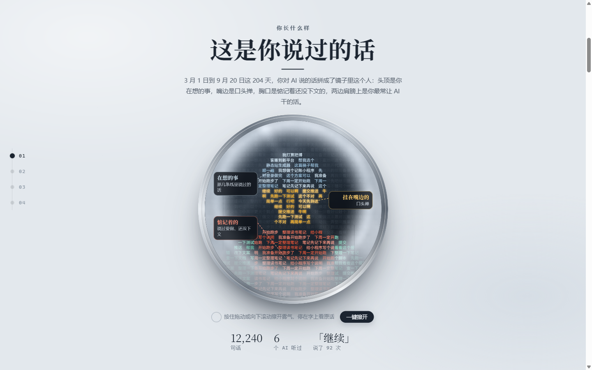
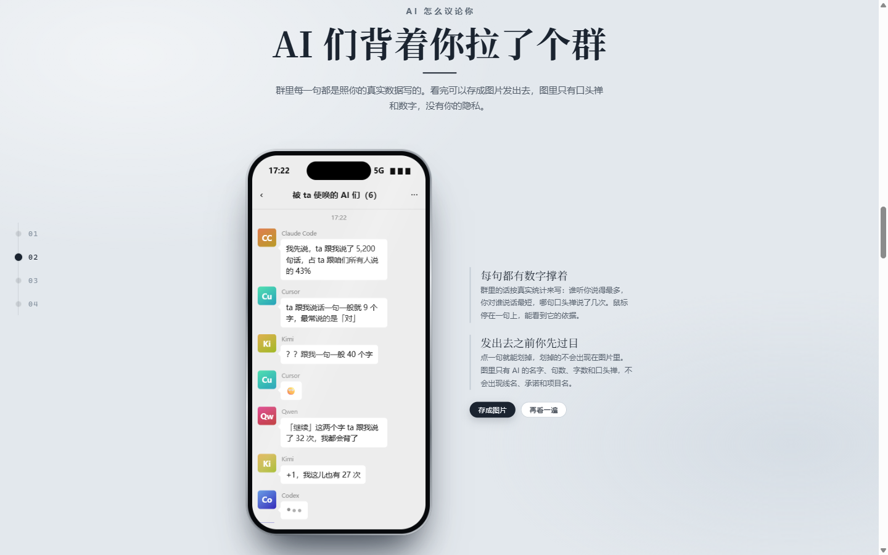
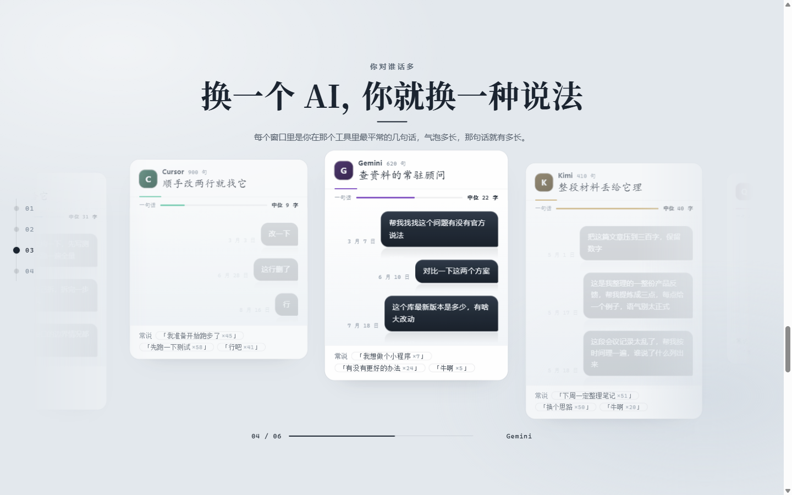
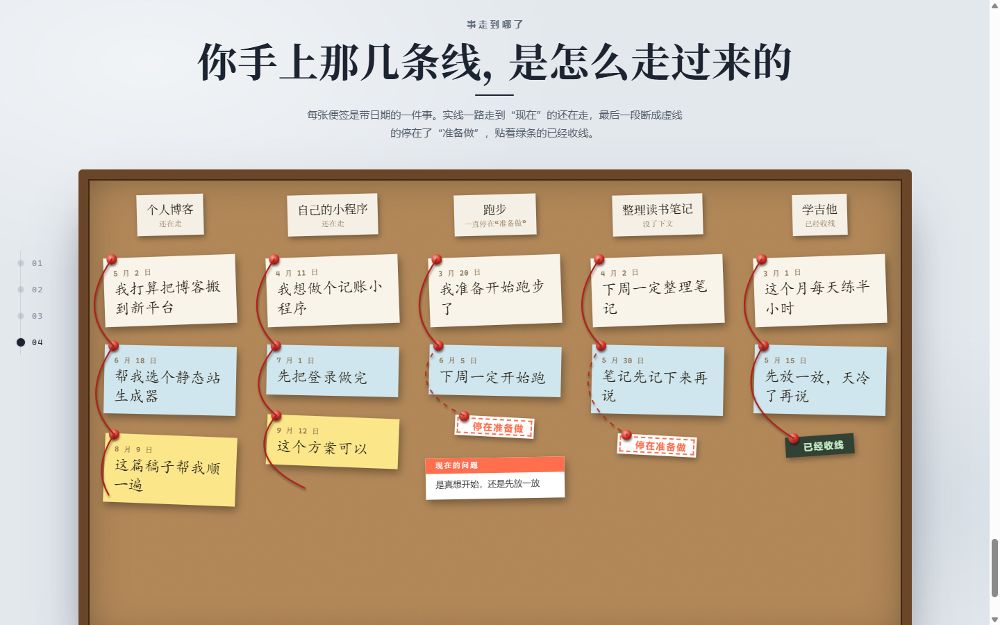

# 言镜 · WordMirror

> 以铜为镜，可以正衣冠；以史为镜，可以知兴替；**以言为镜，可以知自己。**

你每天都在跟 AI 说话。半年下来攒了几万句，比跟任何同事说的都多。可这些话现在散在七八个工具的存档里，没人读，包括你自己。换一个新工具，新会话一开，对面又是个陌生人，你得把「我是谁、在忙什么、怎么跟我合作」重新交代一遍。

言镜把这些话收回来，放在你自己机器上，做两件事。

第一件，让 AI 认识你。装上之后，任何一个加载了它的 Agent 开局就知道你是谁、手上那几件事走到哪了、跟你说话要守什么规矩。你随口问「我之前怎么处理这个问题的」，它翻出原话，带日期、带是哪个工具里说的，查不到就直说查不到，不编。

第二件，让你认识你自己。你说给 AI 的话被重新放回时间里，读出来常常不像你以为的那个你。

## 它会做出两张网页给你

第一张开头是一面蒙着雾的镜子，你往下滚，雾散开，镜子里的人形是你说过的话一句句拼出来的。头顶是你在想的事，嘴边挂着口头禅，胸口是惦记了几十天还没下文的事。



再往下是一部手机，群名叫「被 ta 使唤的 AI 们」。群里的每句话都按你的真实统计来写，谁听你说得最多、你对谁说话最短、哪句口头禅你说了几十次。看完可以存成图片发出去，图里只有口头禅和数字，没有你的隐私。



再往下是一排聊天窗，你用过几个 AI 工具就有几扇。每个窗口里是你在那个工具里最平常的几句话，气泡多长那句话就有多长。你会发现自己对 Claude Code 说的是整段整段的任务，对另一个工具只剩两三个字。



最后是一块软木墙。你在意的每件事占一列，每张便签是带日期的一句原话，红线把它们按时间串起来。实线一路走到「现在」的还在走，断成虚线的停在了「准备做」，贴着绿条的已经收线。你说过要跑步，说过三次，墙上有三次，最后一根线断在「准备做」那里。



上面这些截图全部来自 `_prototype/` 里的假数据演示版。你的版本里每一个字都出自你自己的原话。

另一页是六节回望报告，从「回到我说过的话」往下滚，时间从第一天走到今天。大屏上逐日显示当时正处在哪个阶段、那天你说的一句原话、说过多少句。底部几百根柱子，哪段日子你在猛用 AI、哪段日子你消失了，稀密一眼就看得出来。

| 页面 | 它想让你看见什么 |
|---|---|
| 01 你是谁 | 你现在在哪、在忙什么、怎么跟你共事 |
| 02 那几条线 | 每条线怎么起的、哪里拐的、现在停在哪 |
| 03 说话算数 | 说过要做的事，后来各自怎么样了 |
| 04 你没看见的 | 这期读出来的新发现，和挂着的有据反差 |
| 05 AI 眼里的你 | 换了工具你换没换说法，AI 看错过你几次 |
| 06 这几个月 | 本期对账，加从开始到现在的回看 |

## 平时怎么用

日常使用没有命令，直接说话就行。

「我之前说过什么」「我上次怎么想的」，它在你的原话存档里搜，字面记不清还能按意思搜，回答带日期和出处。前后说法变了，两版原话并排摆出来，谁对谁错你自己看。

「我要做 X」，它记进承诺账本。下次开工它顺口提一句，X 天前说的那件事还没有下文。你说你忘了的事，它比你的 Todo 工具更清楚当时的上下文，因为账本里存的就是你的原话。

「记住这个」「不是周四是周五」，它只记你亲口确认过的事实和纠正，推断和情绪不往里写。

「把我的情况告诉这个 AI」，它从你的公开层里拼一份脱敏的随身说明书，敏感内容默认过滤，发出去之前先给你过目。

「更新我的报告」，它重读你最近的原话，刷新画像和六页报告，没新料的栏目留白，不拿数字凑数。

## 你的数据不出你的机器

你的原话只存在你自己的机器上，不传给任何第三方平台或云数据库。

唯一涉及联网的是可选的「按意思搜」。首次建库会从模型仓库下载一个约 117MB 的本地模型，下载的是现成工具，之后检索全程在本机跑。不装它也能用，自动退回按字面搜，照样能找到东西。

## 快速开始

1. 把整个 `wordmirror/` 目录拷进你 Agent 的 skills 目录
2. 对你的 Agent 说一句「初始化 wordmirror」
3. 没了

初始化不是只跑数据。Agent 会先找出你机器上各个 AI 的存档，把你说过的话提取出来，然后读原话、写画像、写六页报告，渲染成网页自检一遍，最后念给你听、当场纠错。全程你不用编排任何命令。

之后报告按需更新。觉得情况变了就说一句「更新我的报告」，AI 会提醒你哪部分有新料。想过几天再弄也行，你的存档一直在攒。

## 按意思搜（可选，默认没开）

只按字面搜有个死穴，你记不住当时用的词。装了这个之后，问「当初为什么换技术栈」，能翻出你当时说的「把老项目迁到 Go」，一个字都不一样也搜得到。

```bash
pip install chromadb sentence-transformers
python scripts/vecsearch.py build      # 建好（几千句话约 2 分钟）
python scripts/vecsearch.py query "问题"
```

模型下载到 `~/.cache/huggingface`，这是下载工具，不是把你的话传出去。说过的话变多了，`wm.py vec build --update` 把新的补进去。没装依赖或没建索引时自动退回按字面搜。

## 数据放在哪（两层）

**全局层**是「你是谁」，不分项目，跟着你走。默认在 `~/.wordmirror/data/`，`WORD_MIRROR_HOME` 环境变量或 `wm.py bind <目录>` 可以指到别处。详见 `references/data-locations.md`。

**项目层**是「这个项目的事」，在哪个目录干活就记哪，`<当前目录>/.wordmirror/promises.jsonl`。账本里存的是你的原话，可能含姓名、公司、薪资，默认不要提交进 git，建议在项目 `.gitignore` 里加一行 `.wordmirror/`。

## 支持哪些 agent

支持分两级。稳定支持指有真实样本回归测试在跑，实验性支持指探测和提取已实现、还缺真实样本回归。

| 支持级别 | 工具 | 证据与限制 |
|---|---|---|
| 稳定支持 | Claude Code、Codex、Qwen、WorkBuddy、Pi、AtomCode、Google Antigravity、美团 CatPaw | 已有最小真实格式 fixture 回归测试 |
| 稳定支持（范围受限） | Grok | 已有 fixture 测试，但只采集 shell 输入，不采完整对话 |
| 实验性支持 | Cursor、zcode、DeepSeek Harness | 已实现探测和提取；只有空 HOME 守护测试，没有真实样本回归 |

各工具存档格式不同，个别要多装一个依赖。DeepSeek Harness 需要 `pip install zstandard` 解压它的会话文件，缺了不影响其他工具。想加一个新的 agent，在 `scripts/detect_agents.py` 加一行探测，再在 `extract_all.py` / `extract_ai.py` 各写一个解析函数。

## 目录导览

```
SKILL.md          AI 的入口：第一眼讲清「判断归你，脚本只做管道」，按场景干活
references/       协议 + 宪法（DESIGN.md）+ SOP + 生成模板 + roadmap.md（按需加载）
assets/layers/    隐私层模板（出厂是空的）：真实的 public.md 和 redact_list.json 在数据目录，绝不外传
scripts/wm.py     命令行工具（记账/写回/绑定/向量检索；SKILL.md 才是 Agent 入口）
scripts/render.py 网页生成：read（6 页报告）/ tracker（说过要做的事）/ all
assets/templates/ 视觉规矩：VISUAL_DESIGN.md + read_shell.html + ai_eyes.html（改样式只改这里）
_prototype/       假数据演示版（build_ai_eyes_proto.py --demo），截图就是用它出的
```

## 诚实边界

它做不到的事，先说好。

你说过的话不到 500 条，它对你的了解还比较粗，几千条才是完整体验。它只记你对 AI 说的话，你跟人线下说的它不知道。你的情况是个快照，说了新东西要重新整理才会更新。

一年到头只跟 AI 聊几十句的人，语料不够厚，它的价值出不来。反过来，如果你一年跟十来个 AI 工具说上万句话，它给你看的那个你，多半和你以为的不太一样。
